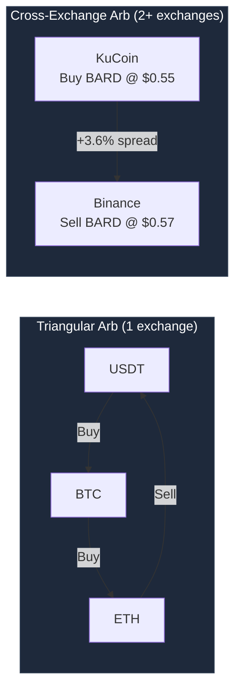
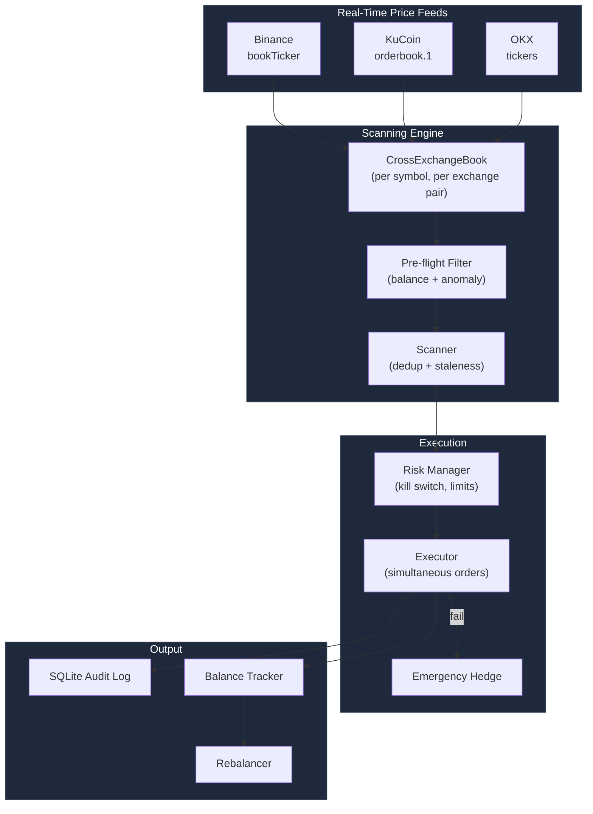

# Crypto Arbitrage Trading System

A Python-based arbitrage detection and execution system supporting **triangular arbitrage** (single exchange) and **cross-exchange arbitrage** (Binance + KuCoin + OKX).

## What It Does



**Cross-exchange arb** is the primary strategy — buying assets cheap on one exchange and selling higher on another. Live market validation shows **+1-5% net spreads** on mid-cap pairs like BARD between KuCoin and Binance.

## Live Results

| Metric | Value |
|--------|-------|
| Opportunities (60s scan) | 20, **100% profitable** |
| Best net spread | **+4.72%** (KuCoin → Binance) |
| Average net spread | **+1.23%** |
| Target pairs | BARD, SAHARA, CFG, ARKM + 17 more |
| Exchanges | Binance, KuCoin, OKX (price feed), Bybit (price feed) |

## System Architecture



## Features

- **4-exchange price feeds** — Binance (bookTicker), KuCoin, OKX, Bybit WebSocket streams
- **Cross-exchange scanning** — aggregated order book per symbol, staleness + anomaly filtering
- **Pre-flight balance filter** — rejects opportunities that can't execute (eliminated 68% waste)
- **Simultaneous execution** — both buy and sell orders fire concurrently via asyncio
- **Maker sell support** — limit sell for lower fees (0.095% vs 0.15% break-even)
- **Emergency hedge** — if one leg fails, immediately close exposure on same exchange
- **Risk management** — kill switch, daily loss limit, consecutive loss halt, imbalance-aware filtering
- **Spread-based position sizing** — 25/50/75/100% of max based on spread confidence
- **Rebalancing** — threshold-based (25% deviation) + opportunity-aware bias
- **Pipeline metrics** — per-symbol P&L, timing instrumentation, abort rate tracking
- **Full audit trail** — every opportunity, trade, and transfer logged to SQLite
- **Triangular arb** — 192 triangles on Binance (works but market too efficient for retail)
- **104 unit tests** passing

## Quick Start

```bash
# Clone
git clone https://github.com/Pann13223029/crypto-triangular-arbitrage.git
cd crypto-triangular-arbitrage

# Setup
python3 -m venv venv
source venv/bin/activate
pip install -r requirements.txt

# Configure
cp .env.example .env
# Edit .env with your API keys (Binance + KuCoin minimum)
```

### Scan Only (no API keys needed for public data)

```bash
# Live scan across 3 exchanges — see real opportunities
python main.py --live-scan --duration 60 --dry-run
```

### Simulated Trading

```bash
# Cross-exchange simulation with O-U price divergence
python main.py --cross-exchange --duration 120

# Original triangular arb simulation
python main.py --mode simulation --duration 120
```

### Live Execution (requires API keys + funds)

```bash
# Execute real trades (asks for YES confirmation)
python main.py --live-scan --execute --duration 60
```

## Project Structure

```
├── main.py                  # Entry point — 4 modes (tri-sim, cross-sim, live-scan, live-execute)
├── config/                  # Dataclass configs (trading, fees, rebalancing, cross-exchange)
├── core/                    # Triangle discovery, scanner, calculator, models
├── cross_exchange/          # Cross-exchange book, scanner, executor, risk manager, balance tracker
├── exchange/                # 4 exchanges: Binance, KuCoin, OKX, Bybit (REST + WebSocket each)
├── execution/               # Triangular executor, risk manager, order manager
├── rebalancing/             # Threshold-based + opportunity-aware rebalancer
├── monitoring/              # Pipeline metrics, per-symbol P&L tracking
├── data/                    # SQLite logging, price cache
├── dashboard/               # Rich CLI monitor
├── backtest/                # Data recorder & replayer
├── tools/                   # Diagnostic scanners (profitability, cross-exchange)
└── tests/                   # 104 tests
```

## Architecture Documents

- [architecture.md](architecture.md) — Triangular arb design (10-expert panel)
- [architecture-cross-exchange.md](architecture-cross-exchange.md) — Cross-exchange design (9-expert panel)

## Exchange Support

| Exchange | Price Feed | Trading | Notes |
|----------|-----------|---------|-------|
| **Binance** | bookTicker WS | Yes (REST + signed) | Primary sell-side |
| **KuCoin** | orderbook.1 WS | Yes (REST + signed) | Primary buy-side |
| **OKX** | tickers WS | Price only | Banned in Thailand |
| **Bybit** | orderbook.1 WS | Price only | IP restricted |

## Safety & Risk

```
Max position:         $10/trade (launch config)
Daily loss limit:     $5 → kill switch
Consecutive losses:   3 → kill switch
Emergency hedges:     3 → kill switch
Min net spread:       1.0% (ignore thin spreads)
Anomaly filter:       >5% spread rejected (likely stale)
Staleness:            3s max for order book data
Withdrawals:          DISABLED on all API keys
```

## Scaling Plan

| Phase | Trades | Size | Mode |
|-------|--------|------|------|
| 1 | 1-10 | $5/leg | Monitored |
| 2 | 11-50 | $10/leg | Autonomous |
| 3 | 51-200 | $20/leg | Auto rebalance |
| 4 | 200+ | Empirical limit | Full auto |

## Disclaimer

This software is for educational and research purposes. Cryptocurrency trading involves significant risk. Use at your own risk.

## License

MIT
