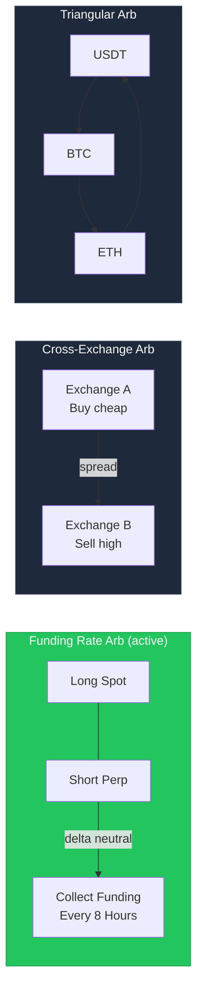
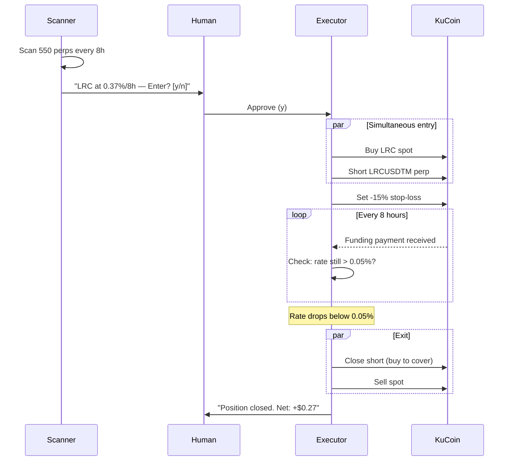

# Crypto Arbitrage Trading System

A Python-based arbitrage system supporting three strategies:

1. **Triangular Arbitrage** — 3-pair cycles on single exchange
2. **Cross-Exchange Arbitrage** — buy low on one exchange, sell high on another
3. **Funding Rate Arbitrage** — delta-neutral, collect funding payments (active strategy)



## Strategy Evolution

| Strategy | Status | Result |
|----------|--------|--------|
| Triangular arb | Built & tested | Market too efficient for retail (0.008% spread vs 0.225% fees) |
| Cross-exchange arb | Built & tested | Inventory risk: tokens drop 10-42% while holding, wiping arb profit |
| **Funding rate arb** | **Live tested** | **2 trades executed. +$0.038 on GF, -$0.014 on TRUTH. Negative EV at $30 — viable at $500+** |
| Stablecoin depeg | Monitor ready | Continuous monitoring of USDT/USDC/DAI/FDUSD across CEX |
| DEX-CEX arb | Scanner ready | DexScreener + GoPlus safety check. Alert-only (Phase 1) |

## Funding Rate Arbitrage

The active strategy. Earns income by exploiting funding rate differences on perpetual futures.



### How It Works

1. **Scanner** finds perpetual contracts with high funding rates (>0.10%/8h)
2. **Human approves** entry (or auto-enter on strong signals)
3. **Executor** simultaneously buys spot + shorts futures = delta-neutral
4. **Every 8 hours**, longs pay shorts → you collect funding
5. **Dynamic exit**: after 2 payments or when rate drops below 0.12%

### Current Opportunities (live scan)

```bash
python -m funding_arb.cli scan
```

Example output:
```
LRCUSDTM          0.3680%/8h  break-even: 5h   *** YES ***
VANRYUSDTM        0.2754%/8h  break-even: 7h   *** YES ***
SUPRAUSDTM        0.2317%/8h  break-even: 8h   *** YES ***
```

### Safety

| Protection | Detail |
|-----------|--------|
| **Delta-neutral** | Long spot + short perp = zero price exposure |
| **Isolated margin** | Only position margin at risk, not whole account |
| **2x leverage max** | Survives 45% adverse move before liquidation |
| **Exchange stop-loss** | -15% on exchange (works even if bot crashes) |
| **98%+ hedge ratio** | Enforced before entry — rejects if can't fully hedge |
| **Dynamic 2-payment exit** | Exit after 2 payments if rate < 0.18%, or rate < 0.12% anytime |
| **Rate consistency** | Requires 2+ scans above threshold before entry |
| **State persistence** | JSON state file survives crashes, reconciles on startup |
| **Orphan detection** | Alerts (never auto-closes) if one leg is missing |

## Quick Start

```bash
# Clone
git clone https://github.com/Pann13223029/crypto-triangular-arbitrage.git
cd crypto-triangular-arbitrage

# Setup
python3 -m venv venv
source venv/bin/activate
pip install -r requirements.txt

# Configure
cp .env.example .env
# Edit .env with KuCoin API key + secret + passphrase
```

### Funding Rate Arb (recommended)

```bash
# Scan for opportunities
python -m funding_arb.cli scan

# Run the bot (scans, asks approval, trades, monitors)
python -m funding_arb.main_loop

# Check readiness (balances, timing, opportunities)
python tools/check_readiness.py
```

### Cross-Exchange Arb

```bash
# Live scan across 4 exchanges (read-only)
python main.py --live-scan --duration 60 --dry-run

# Simulated cross-exchange trading
python main.py --cross-exchange --duration 120
```

### Triangular Arb

```bash
python main.py --mode simulation --duration 120
```

## Project Structure

```
├── funding_arb/             # Funding rate arbitrage (active strategy)
│   ├── scanner.py           # Scans 550 KuCoin perps for funding spikes
│   ├── executor.py          # Enters/exits spot+futures positions
│   ├── position_manager.py  # Entry/exit logic, risk controls
│   ├── kucoin_futures.py    # KuCoin Futures API client
│   ├── main_loop.py         # State machine (IDLE→SCAN→ENTER→MONITOR→EXIT)
│   ├── timing.py            # Funding timestamp utilities
│   ├── state.py             # JSON state persistence + JSONL ledger
│   ├── models.py            # FundingOpportunity, FundingPosition
│   └── cli.py               # CLI: scan, monitor commands
│
├── cross_exchange/          # Cross-exchange arbitrage
│   ├── book.py              # Aggregated order book across exchanges
│   ├── scanner.py           # Spread detection with pre-flight filter
│   ├── executor.py          # Simultaneous orders + emergency hedge
│   ├── risk_manager.py      # Kill switch, imbalance filtering
│   ├── balance_tracker.py   # Multi-exchange balance aggregation
│   ├── pair_manager.py      # Adaptive pair selection (1 active + 4 on-deck)
│   ├── pair_discovery.py    # Full pair scan across exchanges
│   └── models.py            # CrossExchangeOpportunity, etc.
│
├── core/                    # Triangular arbitrage engine
│   ├── triangle.py          # Graph-based triangle discovery
│   ├── scanner.py           # Vectorized opportunity detection
│   ├── calculator.py        # Numpy profit calculation
│   └── models.py            # Ticker, OrderBook, Order, etc.
│
├── exchange/                # Exchange adapters (6 exchanges)
│   ├── binance_th.py        # Binance Thailand (live trading)
│   ├── binance_live.py      # Binance Global (live trading)
│   ├── binance_ws.py        # Binance WebSocket (bookTicker)
│   ├── binance_rest.py      # Binance REST
│   ├── kucoin_rest.py       # KuCoin REST (spot)
│   ├── kucoin_ws.py         # KuCoin WebSocket
│   ├── okx_rest.py          # OKX REST
│   ├── okx_ws.py            # OKX WebSocket
│   ├── bybit_rest.py        # Bybit REST
│   ├── bybit_ws.py          # Bybit WebSocket
│   ├── simulator.py         # Paper trading simulator
│   ├── multi_sim.py         # Multi-exchange O-U simulator
│   └── base.py              # Abstract ExchangeBase interface
│
├── execution/               # Triangular arb execution
├── rebalancing/             # Threshold-based + opportunity-aware
├── monitoring/              # Pipeline metrics, per-symbol P&L
├── dashboard/               # Rich CLI monitor
├── data/                    # SQLite logging, price cache
├── backtest/                # Data recorder & replayer
├── stable_arb/              # Stablecoin depeg monitor
│   ├── detector.py          # Threshold + 3-tick confirmation
│   ├── price_aggregator.py  # Multi-source CEX price collector
│   ├── alert_manager.py     # Terminal + sound alerts by severity
│   └── main_loop.py         # Continuous monitoring loop
│
├── dex_arb/                 # DEX-CEX arbitrage scanner
│   ├── dex_price_feed.py    # DexScreener REST API
│   ├── token_safety.py      # GoPlus honeypot detection
│   └── scanner.py           # Cross-venue spread detection
│
├── tools/                   # Diagnostic scripts
│   ├── check_readiness.py   # Pre-trade readiness check
│   ├── monte_carlo.py       # Strategy simulation (10K paths)
│   ├── scan_cross_exchange.py
│   └── scan_profitability.py
├── tests/                   # 170 tests
└── config/                  # Dataclass-based configuration
```

## Live Trade Results

| # | Token | Duration | Funding | Fees | Net P&L | Hedge | Issue |
|---|-------|----------|---------|------|---------|-------|-------|
| 1 | GF | 4.4h | +$0.072 | -$0.034 | **+$0.038** | 35% | Mismatch (fixed) |
| 2 | TRUTH | 2.4h | $0.000 | -$0.014 | **-$0.014** | 100% | Rate decayed before collection |

Key learnings: hedge ratio enforcement critical, rates decay 50-70% in 4h on micro-caps, entry threshold raised to 0.25%.

## Monte Carlo Simulation

```bash
python tools/monte_carlo.py --capital 30 --months 6 --sims 10000
```

At $30 capital, funding rate arb has **negative expected value** due to fee drag. Strategy becomes viable at **$500+** with maker fees. Current focus: learning + infrastructure for scaling.

## Architecture Documents

- [architecture.md](architecture.md) — Triangular arb design (10-expert panel)
- [architecture-cross-exchange.md](architecture-cross-exchange.md) — Cross-exchange design (9-expert panel)
- [architecture-dex-stable.md](architecture-dex-stable.md) — DEX-CEX arb + stablecoin depeg monitor (5-expert panel)

## Exchange Support

| Exchange | Spot | Futures | WebSocket | Status |
|----------|------|---------|-----------|--------|
| **KuCoin** | REST + WS | REST (futures) | ticker, orderbook | **Active** (funding arb) |
| **Binance TH** | REST | — | bookTicker | Active (cross-exchange sell) |
| **Binance Global** | REST | — | bookTicker | Price feed |
| **OKX** | REST + WS | — | tickers | Price feed only |
| **Bybit** | REST + WS | — | orderbook.1 | Price feed only |

## Configuration

Key parameters in `config/settings.py` and `funding_arb/main_loop.py`:

```yaml
# Funding Rate Arb (post live-trade tuning)
leverage:           2x (isolated margin)
stop_loss:          -15% on exchange
min_funding_rate:   0.25% per 8h to enter (accounts for decay + fees)
exit_funding_rate:  0.12% per 8h to exit
stay_threshold:     0.18% (only stay for 3rd payment if above this)
max_hold:           32 hours
basis_stop_loss:    1.5% divergence
hedge_enforcement:  98%+ or reject trade
entry_mode:         immediate (no window waiting)
rate_consistency:   2+ scans above threshold required
approval:           human (5min timeout)

# Cross-Exchange Arb
max_position:       $10
daily_loss_limit:   $5
min_net_spread:     1.0%
anomaly_filter:     >5% rejected
```

## Tests

```bash
python -m pytest tests/ -v
# 170 tests passing
```

## Disclaimer

This software is for educational and research purposes. Cryptocurrency trading involves significant risk, including the risk of total loss. Use at your own risk. Never trade with money you cannot afford to lose.

## License

MIT
