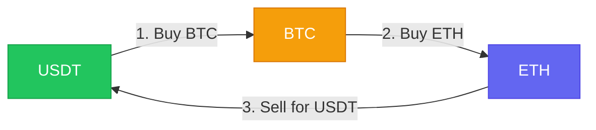
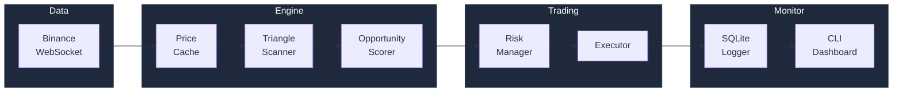
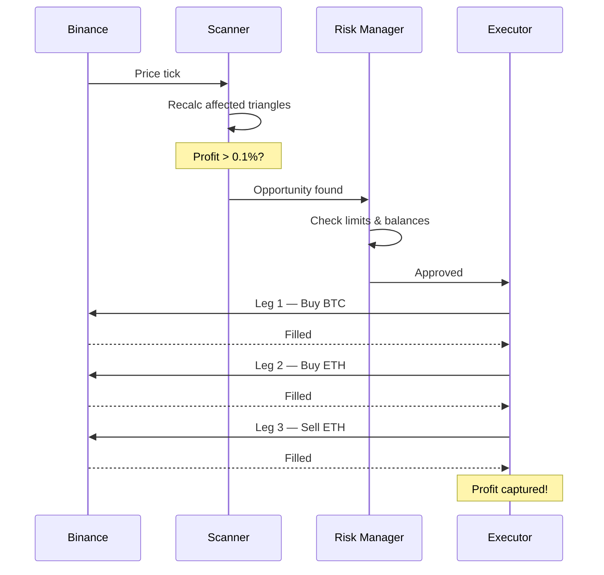
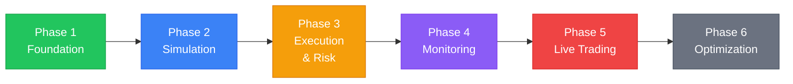

# Crypto Triangular Arbitrage

A Python-based triangular arbitrage detection and execution system for Binance.

## What is Triangular Arbitrage?

Triangular arbitrage exploits price inefficiencies between three trading pairs on the same exchange. If the product of the three exchange rates yields a net gain after trading fees, all three trades are executed to capture the spread.



> All trades happen on **one exchange** — no transfers, no withdrawal risk, no counterparty exposure.

## System Overview



## Features

- **Real-time scanning** — WebSocket price feeds with selective triangle updates
- **Vectorized calculation** — numpy-powered profit detection across 2,000+ triangles
- **Simulation mode** — Paper trading with virtual balances and configurable slippage
- **Risk management** — Position limits, daily loss limits, circuit breakers, kill switch
- **Full audit trail** — Every opportunity logged (executed or skipped) in SQLite
- **CLI dashboard** — Real-time P&L, scan rate, and system health monitoring

## Quick Start

```bash
# Clone the repo
git clone https://github.com/Pann13223029/crypto-triangular-arbitrage.git
cd crypto-triangular-arbitrage

# Create virtual environment
python3 -m venv venv
source venv/bin/activate

# Install dependencies
pip install -r requirements.txt

# Configure (simulation mode by default)
cp .env.example .env

# Run in simulation mode
python main.py --mode simulation
```

## Project Structure

```
├── main.py              # Entry point
├── config/              # Settings, environment config
├── core/                # Triangle discovery, scanner, calculator
├── exchange/            # Binance API (WebSocket + REST) & simulator
├── execution/           # Trade executor, risk manager, order tracking
├── data/                # SQLite logging, in-memory price cache
├── dashboard/           # CLI real-time monitor
├── backtest/            # Data recorder & historical replayer
└── tests/               # Unit & integration tests
```

## How It Works



## Development Phases



1. **Foundation** — Models, triangle discovery, profit calculator
2. **Simulation** — Paper trading with real price feeds
3. **Execution & Risk** — Circuit breakers, position management
4. **Monitoring** — CLI dashboard, opportunity logging
5. **Live Trading** — Testnet validation → gradual live rollout
6. **Optimization** — Backtesting, cross-exchange, performance tuning

## Architecture

See [architecture.md](architecture.md) for the full system design, produced from a 10-expert panel review covering:

- Core algorithm (triangle graph, selective updates, order book awareness)
- Execution strategy (sequential with circuit breaker)
- Risk management (kill switch, position limits, slippage guards)
- Exchange abstraction (simulation ↔ live swap via config)
- Database schema (opportunities, trades, sessions)
- Binance API strategy (WebSocket streams, rate limits, fees)

## Security

- API keys stored in `.env` (never committed)
- Binance keys should have **IP whitelist** and **no withdrawal permission**
- All secrets redacted from logs
- Full audit trail for compliance

## Disclaimer

This software is for educational and research purposes. Cryptocurrency trading involves significant risk. Use at your own risk.

## License

MIT
