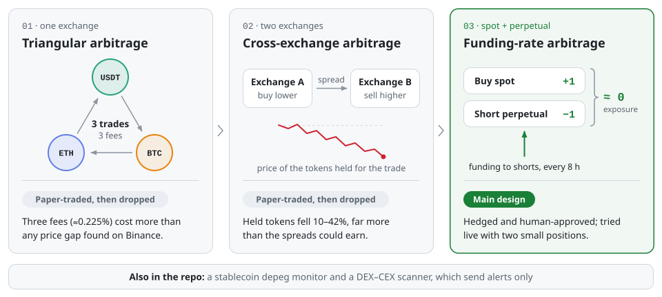
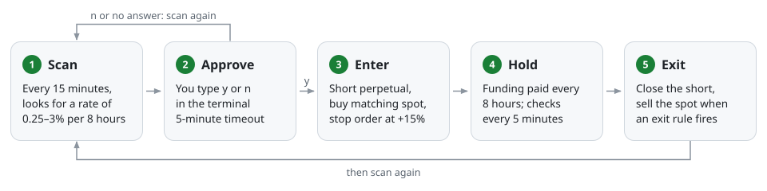

# Crypto arbitrage research and monitoring system

Pann Phetra · [github.com/Pann13223029](https://github.com/Pann13223029)

Python 3.10+ · asyncio · aiohttp (REST and WebSocket) · NumPy · SQLite · pytest

A Python prototype, built in March 2026, that tests crypto arbitrage strategies and watches for opportunities across five exchanges. Five approaches were built and tested in turn. The first two were paper-traded on real market data, then dropped. The third, **funding-rate arbitrage**, became the main design: a hedged bot for KuCoin that asks a person before every trade, with its risk rules in code. The last two only watch the market and send alerts.

<picture>
  <source media="(prefers-color-scheme: dark)" srcset="docs/strategies-dark.svg">
  
</picture>

## The five approaches

| # | Strategy | How it works | Status |
|---|---|---|---|
| 1 | Triangular arbitrage | Three trades on one exchange that end in the starting coin, such as USDT → BTC → ETH → USDT | **Paper-traded, then dropped.** Each cycle pays three taker fees, about 0.225% at 0.075% each, and even the best triangle found on live Binance prices lost money after fees. |
| 2 | Cross-exchange arbitrage | Buy a token where it's cheaper and sell it where it's dearer | **Paper-traded, then dropped.** Gaps on liquid pairs were tiny (0.008% on BTC between Bybit and OKX). Mid-cap tokens had gaps of 0.2–3%, but the bot has to keep a stock of them on the selling exchange, and in paper trading they fell 10–42% while held. |
| 3 | Funding-rate arbitrage | Hold a token in spot, short the same amount in a perpetual future, and collect the funding paid every 8 hours | **Main design.** Tried live with two small positions on KuCoin; see [the live test](#live-test) below. |
| 4 | Stablecoin depeg monitor | Watches USDT, USDC, DAI, FDUSD and TUSD on KuCoin and Binance over WebSocket | **Alert-only.** Flags a move of 0.3% or more from $1 that holds for 3 ticks within a minute, graded from mild to crisis (5% or more). |
| 5 | DEX–CEX scanner | Compares DexScreener prices with exchange prices and screens each token with GoPlus first | **Alert-only.** A module with tests; not wired to a command yet. |

## Funding-rate arbitrage

Perpetual futures never expire, so exchanges keep their price close to the spot price with a **funding rate**: every 8 hours, one side pays the other. When the rate is positive, longs pay shorts. Holding a token in spot while shorting the same amount in the perpetual hedges the price, since a gain on one leg is a loss on the other, and the short side collects the payment. The hard part is everything around that: fees, rates that fade within hours, one leg of the trade failing, and contract sizes that don't fit the budget.

<picture>
  <source media="(prefers-color-scheme: dark)" srcset="docs/funding-cycle-dark.svg">
  
</picture>

**Entry.** Every 15 minutes the scanner reads the funding rate of every USDT perpetual on KuCoin. A contract qualifies when longs pay, the rate is between 0.25% and 3% per 8 hours (anything higher is treated as bad data), and the exchange's predicted next rate isn't negative. From the second scan on, the bot prefers contracts whose rate was also high on the scan before. Once a person approves, it sizes the short in whole contract lots and buys exactly that amount in spot, and it refuses the trade if one lot costs more than the spot budget or if rounding leaves the hedge under 95%. The short goes first as a market order; the spot buy tries a limit order at the ask, then a market order. If the spot leg fails, the short is closed at once. Last, a stop order goes on the short at +15%.

**Exit.** At each check (every 5 minutes), the bot closes the short and sells the spot it actually holds if one of these is true:

- the rate drops below 0.12% per 8 hours (if the next payment is less than 10 minutes away, it waits for it first);
- two payments are in and the rate is below 0.18%;
- three payments are in;
- the position is 32 hours old;
- the spot and perpetual prices are more than 1.5% apart.

### Risk controls

| Control | What it does |
|---|---|
| Hedged position | Spot and perpetual in the same size, so a price move hits the two legs in opposite directions |
| Hedge check | Futures sized in whole lots first and spot matched to them; no trade below a 95% hedge |
| Isolated margin, 2x leverage | The futures leg is backed by its own margin, not by the whole account |
| Stop order on the exchange | A stop order on the short at +15%, held by the exchange rather than by the bot |
| A person approves each entry | A "y" at the terminal, with a 5-minute timeout. An auto-enter switch exists; it's off by default |
| Failed legs | If the spot buy fails, the short is closed at once. If an exit fails, the bot stops and raises an alert |
| State file | The open position is saved to a JSON file and checked against the exchange on start; the bot resumes if the two match |
| Orphan alerts | A position on the exchange with no matching state raises an alert, and the bot won't start until it's sorted out by hand; it doesn't close anything itself |

### Live test

In March 2026 the bot ran on KuCoin with a $30 account and took two small positions:

| Trade | Entry rate (per 8 h) | Held | Hedge | Funding ($) | Fees ($) | Net ($) | Why it closed |
|---|---|---|---|---|---|---|---|
| GF | 0.41% | 4.4&nbsp;h | 35% | +0.072 | −0.034 | **+0.038** | The rate fell to 0.11% |
| TRUTH | 0.30% | 2.4&nbsp;h | 100% | 0.000 | −0.014 | **−0.014** | The rate fell to 0.12% before the first payment |

The Monte Carlo verdict at $30 is a negative expected value. `python tools/monte_carlo.py --capital 30` runs 10,000 six-month paths under the simulator's default assumptions: a 0.20% average entry rate that fades each period, 0.32% in round-trip fees, and a small chance of a liquidation or a stop-out on each trade. The average path loses about 11% of the account, and only about 1 path in 6 ends ahead. Everything in the model scales with the account, so a bigger account alone wouldn't change the verdict; only lower fees, higher rates or fewer forced exits would move it.

### What the live test changed

The two trades turned up four bugs and one wrong assumption. All five fixes are in the code:

1. **Hedge size.** One futures lot of a small token was worth more than the spot budget, so the first position was only 35% hedged. The bot now sizes the futures in whole lots first, matches the spot to them, and refuses trades it can't hedge.
2. **Exit amount.** The exit tried to sell the planned amount of spot rather than what the account held. It now reads the real balance first.
3. **Silent restart.** After a restart, the bot went back to monitoring without its position in memory and quietly did nothing. It now rebuilds the position from the state file.
4. **Futures limit orders.** Switching futures orders to limit orders to save fees failed on some contracts because of tick-size formatting. Futures now use market orders; spot keeps a limit order at the ask with a market fallback.
5. **Fading rates.** On small tokens, funding rates fell 50–70% within about 4 hours. The entry bar went from 0.10% to 0.25% per 8 hours, and the scanner now checks that a rate holds across scans.

## Engineering

- **Exchange adapters** for KuCoin (spot and futures), Binance, Binance Thailand, OKX and Bybit, written directly against the exchanges' REST and WebSocket APIs with aiohttp and HMAC-SHA256 request signing, behind one `ExchangeBase` interface.
- **asyncio throughout:** WebSocket price feeds that reconnect on their own, both legs of a cross-exchange trade placed at the same time, and a state machine for the funding-rate bot (idle → scanning → awaiting approval → entering → monitoring → exiting).
- **Simulation before real money:** a paper-trading exchange, a multi-exchange simulator whose prices drift apart and back (an Ornstein–Uhlenbeck process), and a recorder and replayer for backtests.
- **Tools:** a terminal dashboard (Rich), a pre-trade readiness check, profitability scans for triangles and cross-exchange spreads, and a Monte Carlo simulator that runs 10,000 six-month paths of the funding-rate strategy under set assumptions about rates, fees and risk events.
- **170 tests** (pytest) for the profit math, scanners, executors, risk managers, funding logic and timing, depeg detection, the DEX scanner and the simulators.

## Run it

Needs Python 3.10 or later.

```bash
git clone https://github.com/Pann13223029/crypto-triangular-arbitrage.git
cd crypto-triangular-arbitrage
python3 -m venv venv
source venv/bin/activate
pip install -r requirements.txt
python -m pytest tests/ -q
```

These read public market data or simulate trades, so they need no API keys:

```bash
# Current funding rates on KuCoin
python -m funding_arb.cli scan

# Triangular arbitrage: live Binance prices, virtual trades
python main.py --mode simulation --duration 120

# Cross-exchange arbitrage on simulated exchanges
python main.py --cross-exchange --duration 120

# Cross-exchange scan: live prices from 4 exchanges, no orders (Ctrl+C to stop)
python main.py --live-scan --dry-run

# Stablecoin depeg monitor
python -m stable_arb.main_loop --duration 300

# Monte Carlo options
python tools/monte_carlo.py --help
```

The funding-rate bot trades real money. To run it, copy `.env.example` to `.env` and add KuCoin API keys that can trade but not withdraw, limited to your IP address. Then:

```bash
python tools/check_readiness.py    # balances, funding timing and current candidates
python -m funding_arb.main_loop    # scans, asks for approval, trades and monitors
```

Its thresholds, timing, leverage and stop distance are set at the top of `funding_arb/main_loop.py`; the triangular and cross-exchange settings are in `config/settings.py`.

## Project layout

```
funding_arb/      Funding-rate bot: scanner, executor, position manager, state machine,
                  KuCoin futures client, state file and CLI
cross_exchange/   Cross-exchange arbitrage: merged order book, spread scanner, executor,
                  risk manager (kill switch), pair discovery and selection, balance tracking
core/             Triangular arbitrage: triangle discovery on a pair graph, vectorized
                  scanner, NumPy profit math
execution/        Order execution and risk checks for triangular trades
exchange/         Adapters for KuCoin, Binance, Binance Thailand, OKX and Bybit,
                  plus a paper-trading and a multi-exchange simulator
stable_arb/       Stablecoin depeg monitor
dex_arb/          DEX–CEX scanner with token-safety checks
rebalancing/      Moving funds between exchanges (threshold-based and opportunity-aware)
backtest/         Price recorder and replayer
dashboard/        Rich terminal dashboard
monitoring/       Pipeline timing metrics
data/             SQLite logging and price cache
tools/            Readiness check, profitability scans, Monte Carlo simulator
config/           Dataclass-based settings
tests/            170 pytest tests
docs/             README figures
```

## Design notes

Three longer documents cover the designs in detail, with Mermaid diagrams:

- [architecture.md](architecture.md): triangular arbitrage
- [architecture-cross-exchange.md](architecture-cross-exchange.md): cross-exchange arbitrage
- [architecture-dex-stable.md](architecture-dex-stable.md): the DEX–CEX scanner and the stablecoin depeg monitor

Each design went through a simulated review before it was built: AI personas with different specialties (quant, exchange, risk, security and others) critiqued it. The reviewer names in these documents belong to those personas, not to real people.

## Disclaimer

For education and research only; not financial advice. Crypto trading carries a high risk of loss, including total loss. Use this code at your own risk, and never trade money you can't afford to lose.

## License

[MIT](LICENSE)
