# Cross-Exchange Arbitrage — Architecture Document

> Consensus from expert panel reviews (9-expert design panel + 8-expert pre-launch review).

> **Status: BUILT, DEPRIORITIZED.** System verified with real market data but discovered fundamental inventory risk: tokens drop 10-42% while holding, wiping arb profit. Spreads also rotate daily (BARD→SAHARA→gone). Strategy pivoted to **funding rate arbitrage** (delta-neutral, no inventory risk). Cross-exchange infrastructure remains functional for future use.

---

## 0. Current Implementation Status

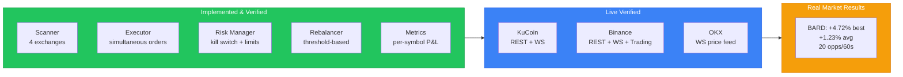

| Component | Status | Tests |
|-----------|--------|-------|
| CrossExchangeBook | Done | 8 |
| CrossExchangeScanner + pre-flight | Done | 4 |
| CrossExchangeExecutor + maker sell | Done | 5 |
| CrossExchangeRiskManager + imbalance | Done | 10 |
| RebalanceManager | Done | 11 |
| Binance (REST + WS + Live) | Done | — |
| KuCoin (REST + WS) | Done | — |
| OKX (REST + WS) | Done | — |
| Pipeline Metrics | Done | — |
| **Total** | **104 passing** | |

### Active Exchange Configuration

| Exchange | Role | API | WebSocket Stream |
|----------|------|-----|-----------------|
| **Binance** | Sell side | Full (signed) | bookTicker |
| **KuCoin** | Buy side | Full (signed) | orderbook.1 |
| **OKX** | Price feed only | Public | tickers |
| **Bybit** | Price feed only | Public | orderbook.1 |

### Verified Profitable Pairs

| Pair | Route | Avg Net Spread | Opportunities/min |
|------|-------|---------------|-------------------|
| BARDUSDT | KuCoin → Binance | +3.5% | ~20 |
| BARDUSDT | OKX → Binance | +2.5% | ~10 |
| SAHARAUSDT | OKX → Binance | +0.2% | ~3 |
| CFGUSDT | Binance → OKX | +0.07% | ~1 |

---

## 1. Overview

Cross-exchange arbitrage buys an asset cheap on one exchange and sells it higher on another. Unlike triangular arb (3 pairs, 1 exchange), this exploits **price fragmentation** across exchanges.

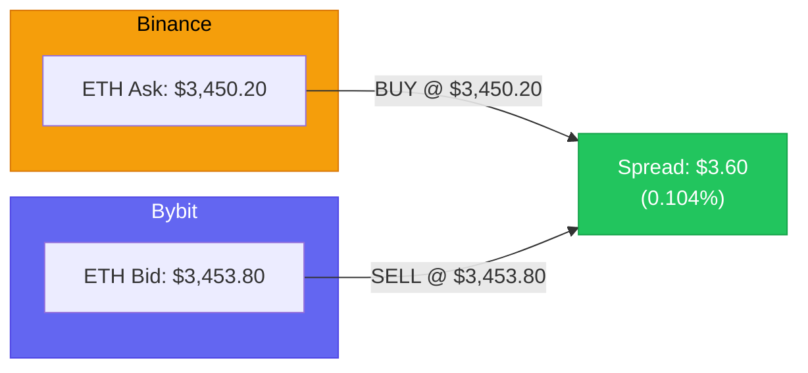

### Why Cross-Exchange?

| Property | Triangular (Current) | Cross-Exchange (New) |
|----------|---------------------|---------------------|
| Opportunity frequency | Rare (market very efficient) | 5-10x more frequent |
| Typical spread | 0.01-0.05% | 0.1-0.5% |
| Execution complexity | 3 legs, 1 exchange | 2 legs, 2 exchanges |
| Capital requirement | Single exchange | Split across exchanges |
| Main risk | Execution speed | Balance fragmentation, exchange counterparty |

---

## 2. System Architecture

### 2.1 High-Level Design

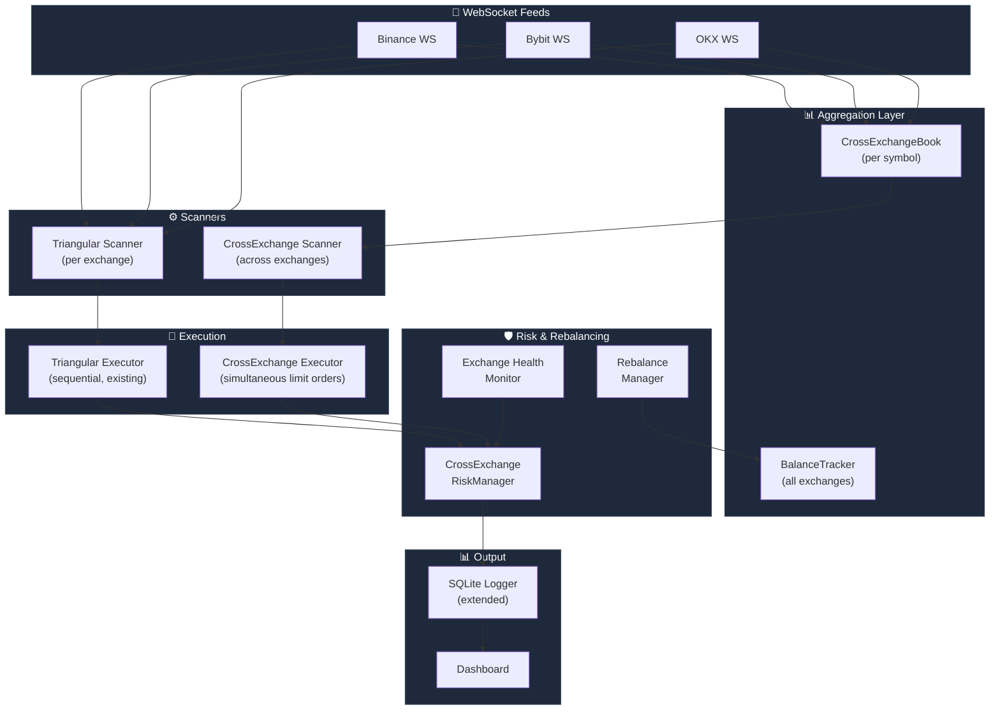

### 2.2 Interaction Sequence

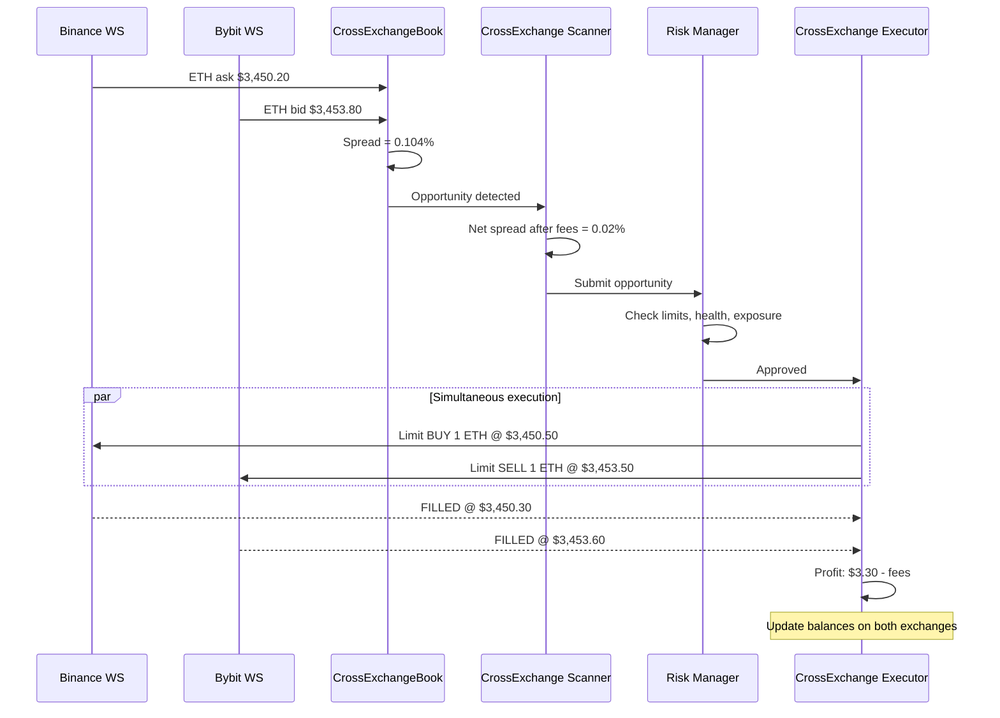

---

## 3. Balance Model: Pre-Funded

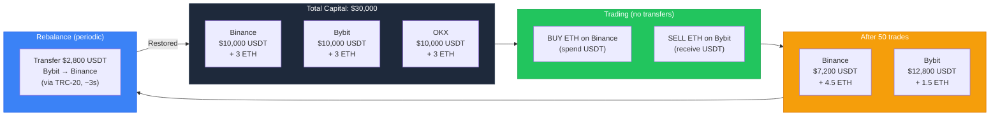

> **Key decision:** Pre-funded balances on all exchanges. No real-time blockchain transfers during trades. Rebalance periodically via stablecoins on fast chains.

### Rebalancing Triggers

| Parameter | Value |
|-----------|-------|
| Deviation threshold | 25-30% from target allocation |
| Minimum rebalance amount | $500 |
| Cooldown between rebalances | 2 hours |
| Preferred chain | TRC-20 (USDT) or Solana (USDC) |
| Max concurrent rebalances | 1 |

---

## 4. Exchange Selection

> **Updated:** Original plan was Binance→Bybit→OKX. Due to geo-restrictions (OKX banned in Thailand, Bybit IP restricted), the active configuration is **Binance + KuCoin** for trading, with OKX/Bybit as price-feed-only sources.

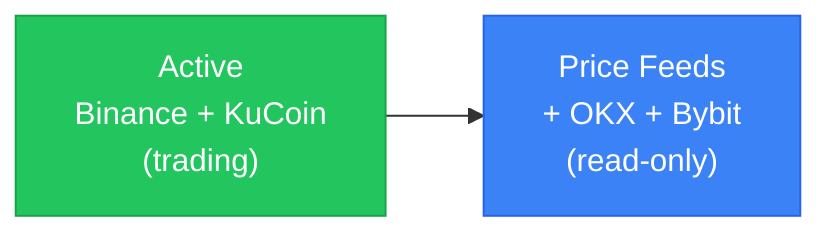

| Exchange | API Quality | WS Stability | Taker Fee | Role | Status |
|----------|-------------|-------------|-----------|------|--------|
| **Binance** | 9/10 | 9/10 | 0.075% (BNB) | Sell side | Active (API key) |
| **KuCoin** | 7/10 | 7/10 | 0.10% | Buy side | Active (API key) |
| **OKX** | 8/10 | 8/10 | 0.10% | Price feed | Banned in Thailand |
| **Bybit** | 8/10 | 3/10 (spot) | 0.10% | Price feed | IP restricted |

### Fee Structure

| Exchange | Default Taker | Maker | Break-even (taker/taker) |
|----------|--------------|-------|--------------------------|
| Binance | 0.075% (BNB) | 0.075% | — |
| KuCoin | 0.100% | 0.100% | — |
| **Binance + KuCoin** | — | — | **0.175%** |
| **With maker sell** | — | — | **0.095%** |

### Why KuCoin Works Better Than Expected

KuCoin was originally rated "optional" but turned out to have the **widest spreads** on mid-cap pairs:
- BARD KuCoin→Binance: +4.72% net (vs OKX→Binance: +2.70%)
- 923 USDT pairs, all 9 target pairs available
- Higher spreads compensate for slightly lower API reliability

---

## 5. Exchange Abstraction

### 5.1 Extended Interface (Hybrid Approach)

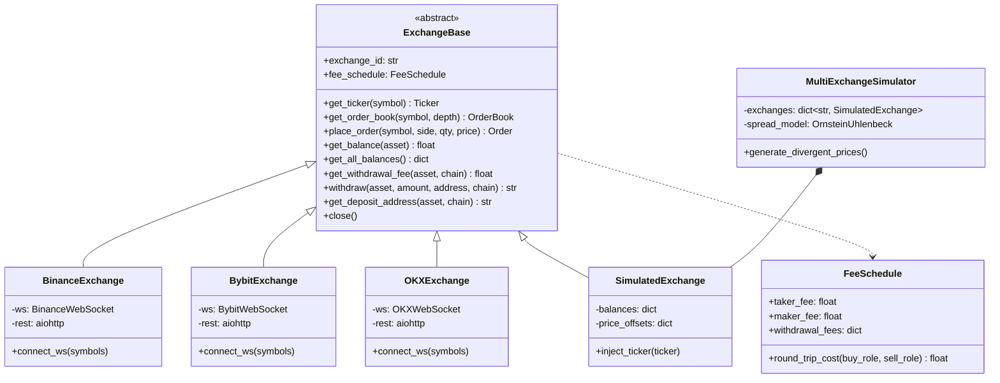

> **Key decision:** Direct implementations per exchange (no ccxt on hot path). Maximum performance, full control over WebSocket handling, exchange-specific optimizations.

---

## 6. Opportunity Detection

### 6.1 CrossExchangeBook

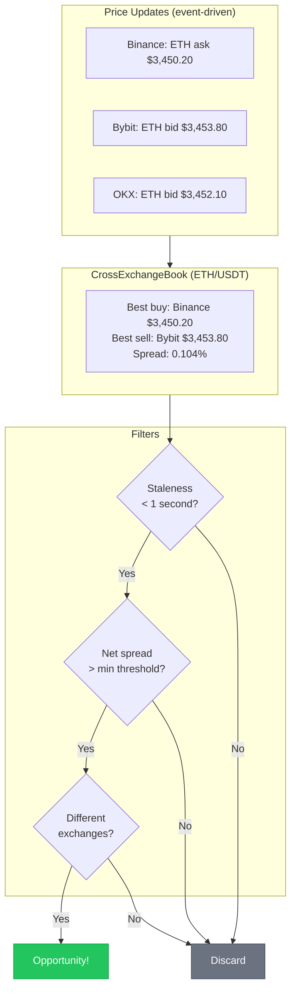

### 6.2 Dual Scanner Architecture

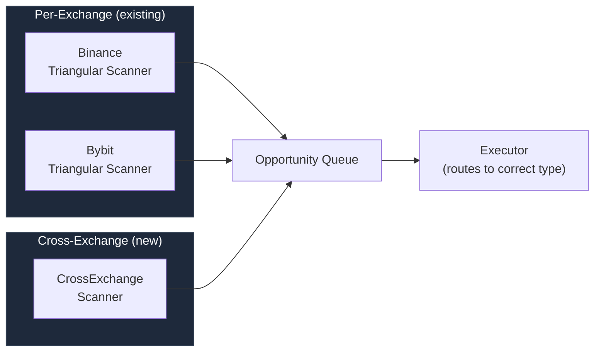

> Triangular arb *within* each exchange + cross-exchange arb *between* them. Multiple profit sources from the same infrastructure.

---

## 7. Execution Strategy

### 7.1 Simultaneous Limit Orders

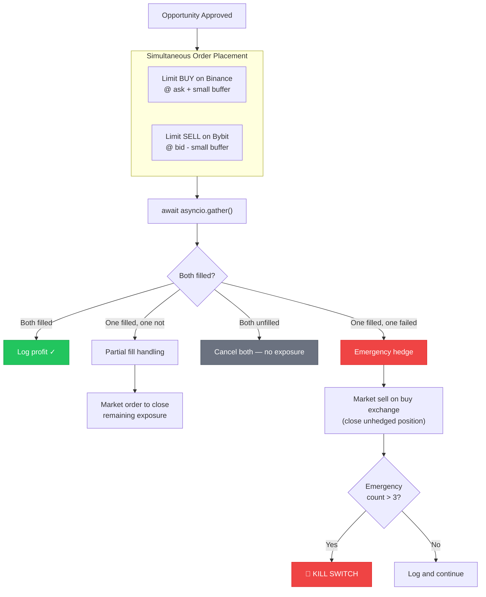

### 7.2 Execution State Machine

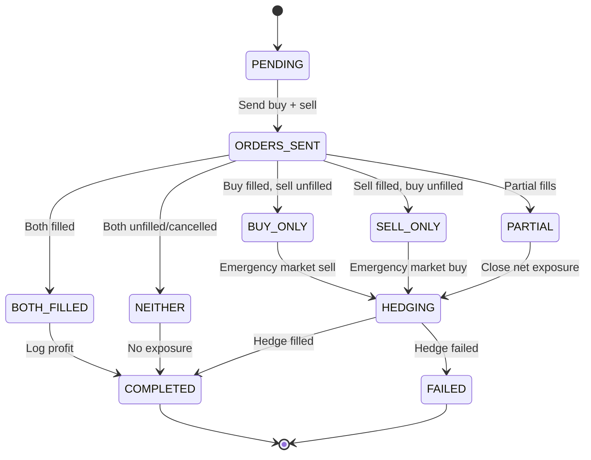

### 7.3 Failure Handling Matrix

| Buy Result | Sell Result | Action |
|-----------|-------------|--------|
| Filled | Filled | Log profit |
| Filled | Partial | Market-sell remainder on sell exchange |
| Filled | Failed | **Emergency:** market-sell on buy exchange |
| Partial | Filled | Market-buy remainder on buy exchange |
| Partial | Partial | Close net exposure on whichever exchange |
| Failed | Any | Cancel sell if pending. No exposure. |

---

## 8. Position Sizing

### 8.1 Book-Walking Algorithm

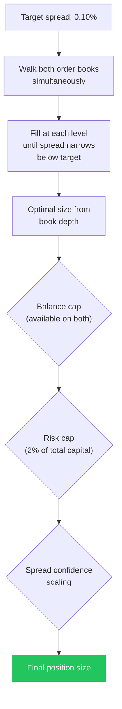

### 8.2 Spread-Based Confidence Scaling

| Net Spread (after fees) | Position Size (% of max) |
|------------------------|--------------------------|
| 0.05 - 0.10% | 25% (marginal) |
| 0.10 - 0.20% | 50% |
| 0.20 - 0.50% | 75% |
| > 0.50% | 100% (but verify — may be stale prices) |

> Spreads > 0.5% on liquid pairs trigger an anomaly check before execution.

---

## 9. Risk Management

### 9.1 Enhanced Risk Decision Tree

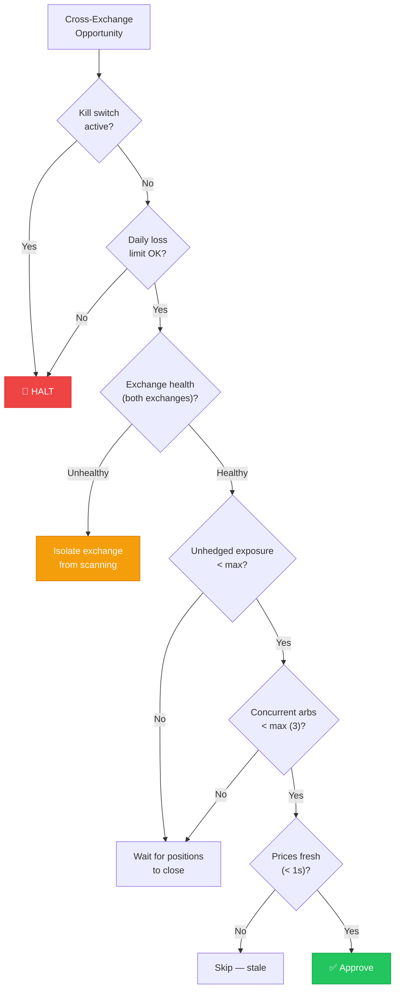

### 9.2 New Risk Dimensions

| Risk Type | Mitigation |
|-----------|-----------|
| **Execution risk** (2 exchanges, 2 networks) | State machine executor, emergency hedge |
| **Counterparty risk** (N exchanges) | Per-exchange cap (max 33% of capital), PoR monitoring |
| **Balance fragmentation** | Threshold-based rebalancing + opportunity-aware bias |
| **Stale price risk** (N feeds) | Max-age filter (1s), staleness check before execution |
| **Exchange degradation** | Exchange health monitor, automatic isolation |
| **Emergency hedge cascade** | 3 emergency hedges/hour → kill switch |

### 9.3 Exchange Health Monitor

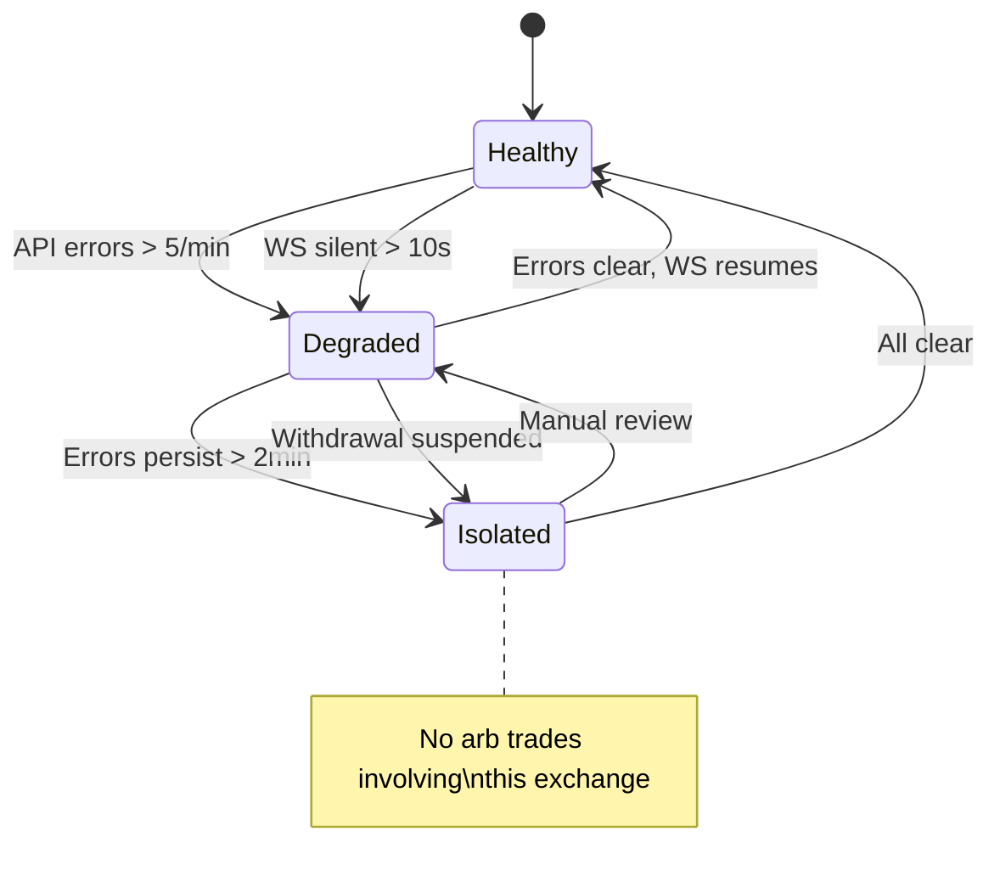

---

## 10. Data & Logging (Extended)

### 10.1 New Database Tables

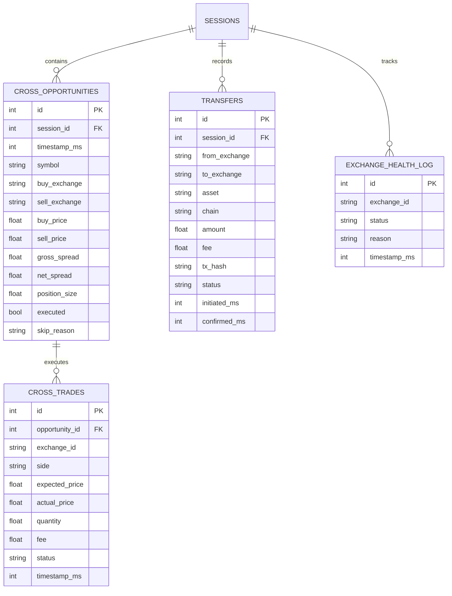

---

## 11. Project Structure (New Components)

```
crypto-triangular-arbitrage/
├── ... (existing modules unchanged)
│
├── exchange/
│   ├── base.py              # Extended with cross-exchange methods
│   ├── binance_exchange.py  # Binance direct implementation
│   ├── bybit_exchange.py    # NEW: Bybit V5 API
│   ├── okx_exchange.py      # NEW: OKX API (Phase 2)
│   ├── simulator.py         # Extended for multi-exchange sim
│   └── multi_sim.py         # NEW: Multi-exchange simulator
│
├── cross_exchange/          # NEW MODULE
│   ├── book.py              # CrossExchangeBook (aggregated per symbol)
│   ├── scanner.py           # CrossExchangeScanner
│   ├── executor.py          # State machine executor (simultaneous)
│   ├── models.py            # CrossExchangeOpportunity, etc.
│   └── balance_tracker.py   # Real-time balance tracking
│
├── rebalancing/             # NEW MODULE
│   ├── manager.py           # RebalanceManager (threshold + bias)
│   ├── transfer.py          # TransferManager (chain selection, monitoring)
│   └── models.py            # Transfer, RebalanceDecision
│
├── monitoring/              # NEW MODULE
│   ├── exchange_health.py   # ExchangeHealthMonitor
│   └── fee_manager.py       # Dynamic fee schedules
│
└── tests/
    ├── test_cross_book.py
    ├── test_cross_executor.py
    ├── test_rebalancing.py
    └── test_exchange_health.py
```

---

## 12. Development Roadmap

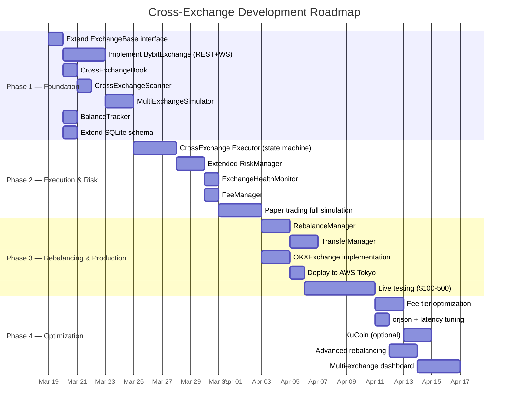

---

## 13. Key Architecture Decisions Summary

| Decision | Choice | Rationale |
|----------|--------|-----------|
| **Balance model** | Pre-funded on all exchanges | Instant execution, no blockchain delays |
| **API approach** | Direct implementations per exchange | Max performance, debuggability |
| **Opportunity detection** | Centralized aggregated book, event-driven | Minimum detection latency |
| **Execution** | Simultaneous limit orders | Minimizes timing risk; unfilled = no exposure |
| **Failure handling** | State machine + emergency hedge | Covers all failure scenarios |
| **Rebalancing** | Threshold (25-30%) + opportunity bias | Balances efficiency vs transfer costs |
| **Position sizing** | Book-walking + risk cap (2% capital) | Respects actual liquidity |
| **Fees** | Dynamic per-exchange, queried at startup | Fees vary by tier/token |
| **Risk management** | Extended existing + exchange isolation | Preserves working controls |
| **Exchanges** | Binance → Bybit → OKX → KuCoin | Best APIs, liquidity, PoR |
| **Deployment** | AWS Tokyo (ap-northeast-1) | Optimal latency to all targets |
| **Testing** | Multi-exchange simulator (O-U spreads) | Realistic testing before live |
| **JSON parsing** | orjson (3-10x faster) | Thousands of WS messages/sec |

---

## 14. Coexistence with Triangular Arb

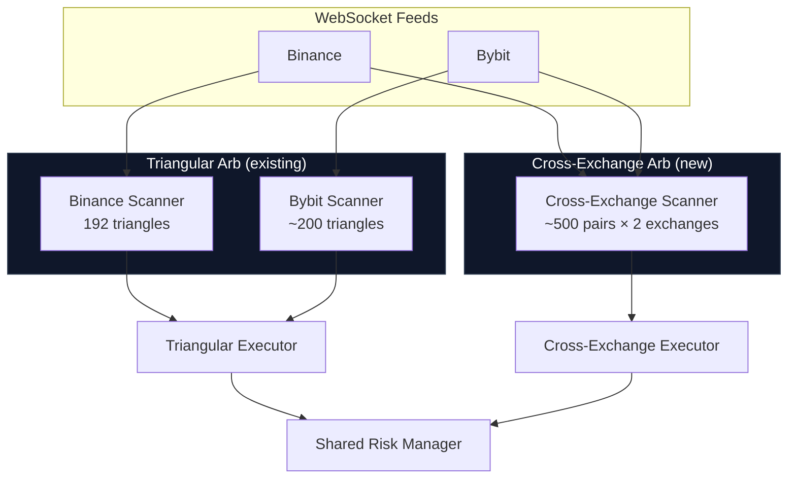

> Both strategies run concurrently, share risk limits, and multiply profit sources.

---

*Document generated from expert panel consensus — Dr. Elena Vasquez, Marcus Chen, Aisha Patel, Tomasz Kowalski, Dr. Yuki Tanaka, James Okafor, Sofia Reyes, Dr. Raj Mehta, Lena Hoffmann*
