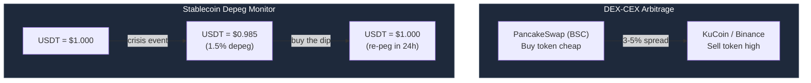
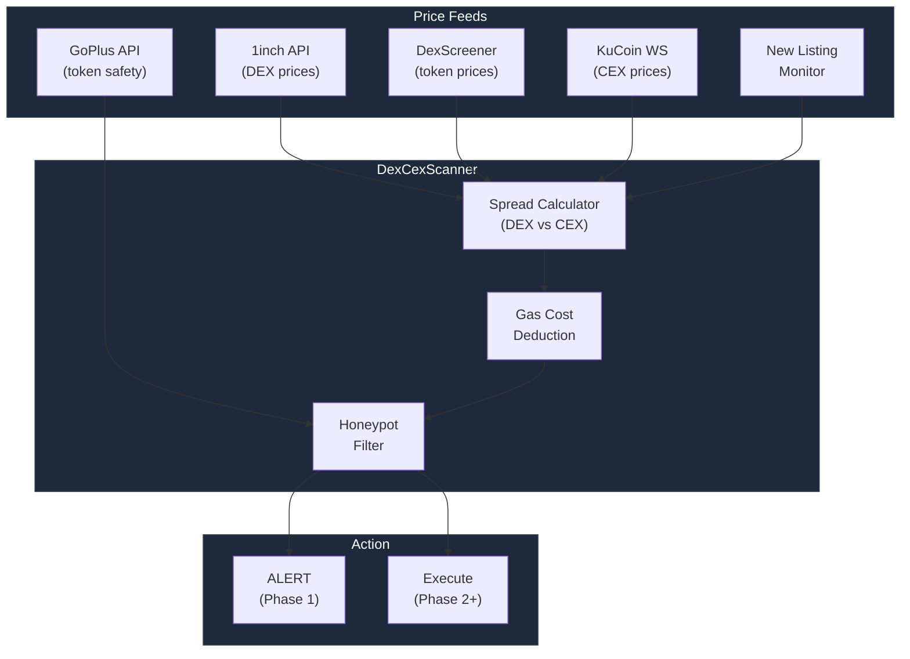
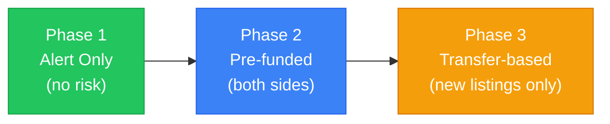
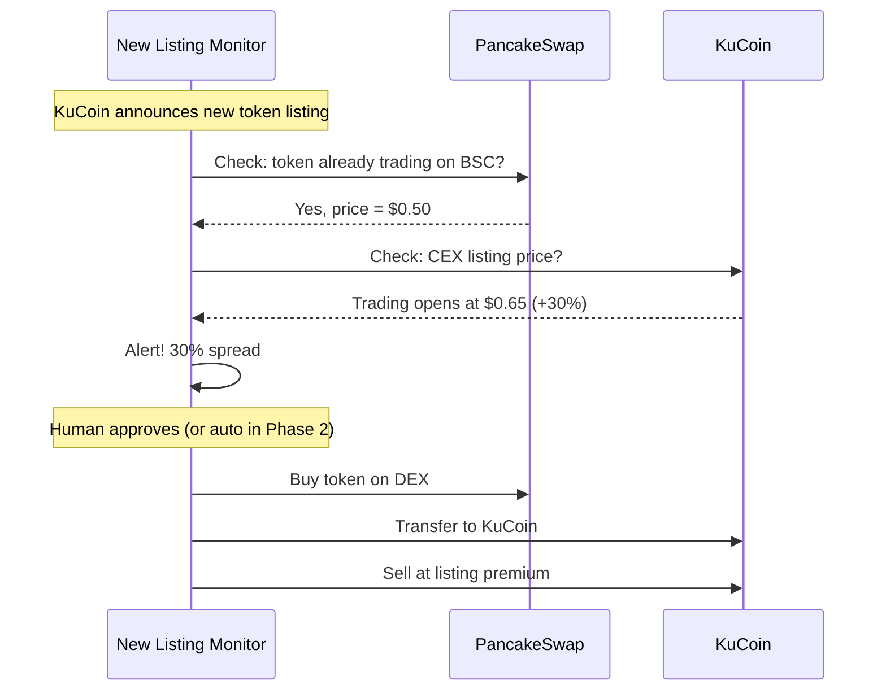
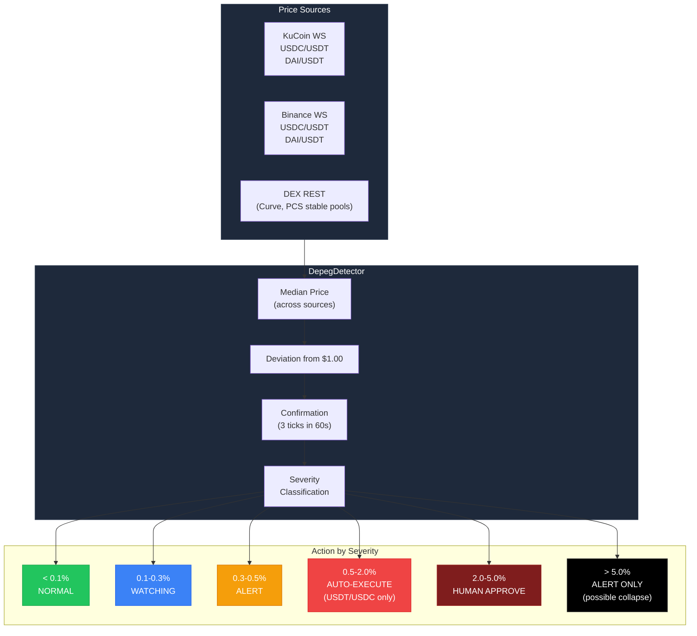
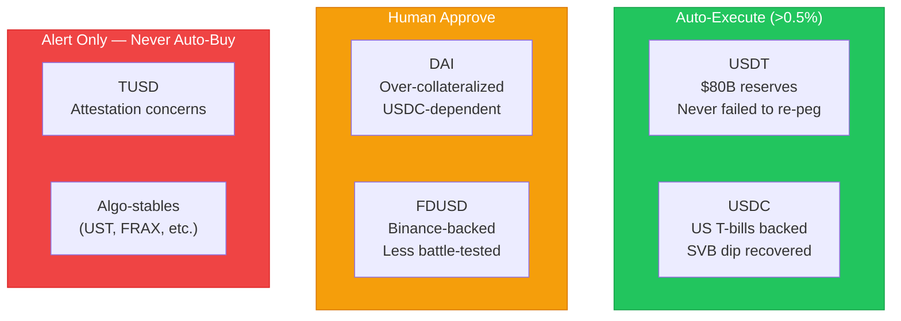
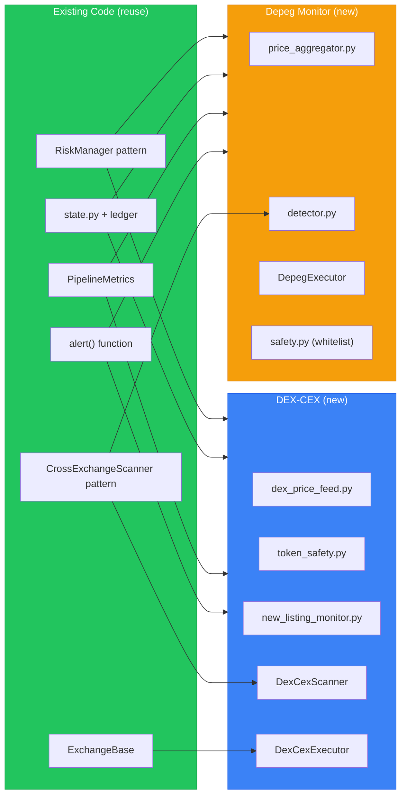
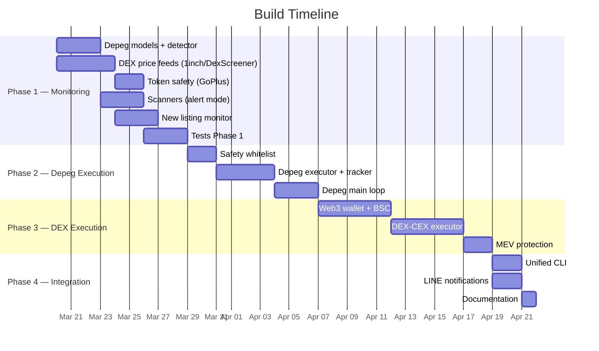

# DEX-CEX Arbitrage & Stablecoin Depeg Monitor — Architecture Document

> Consensus from 5-expert panel review (discuss → brainstorm → debate → discuss).
> Lisa Park (DeFi/DEX), Marcus Chen (CEX), Dr. Wei Chen (Quant), Prof. Krishnamurthy (Risk), JT Thornton (Practitioner).

> **Status: ARCHITECTURE APPROVED.** Phase 1 (monitoring + alerts) in development.

---

## 1. Strategy Overview



### Why These Two Strategies

| Strategy | Edge | Risk | Frequency |
|----------|------|------|-----------|
| **DEX-CEX** | 3-30% on new listings, 1-5% on mid-caps | Honeypots, transfer time | 2-5 opportunities/week |
| **Stablecoin Depeg** | 1-15% on major stablecoins | UST-style collapse (whitelisted stables only) | 2-5 events/year |
| Combined | Growth engine + crisis alpha | Diversified | Continuous monitoring |

---

## 2. Strategy 1: DEX-CEX Arbitrage

### 2.1 Architecture



### 2.2 Chain Selection

| Chain | Gas Cost | Deposit to KuCoin | Token Overlap | MEV Risk | Verdict |
|-------|----------|-------------------|---------------|----------|---------|
| **BSC** | $0.03-0.10 | 3-5 min | ~200 tokens | Medium | **Primary** |
| Arbitrum | $0.01-0.05 | 7-day L1 withdrawal | ~40 tokens | Low | Secondary |
| Solana | $0.001 | ~25 sec | ~30 tokens | Low | Future |

### 2.3 Execution Phases



| Phase | Model | Risk | When |
|-------|-------|------|------|
| 1 | Alert: detect spread, notify human | Zero | Now |
| 2 | Pre-fund DEX wallet + CEX, execute simultaneously | Low | After 2 weeks monitoring |
| 3 | Transfer-based: buy DEX → send to CEX → sell | Medium | Only for >5% persistent spreads |

### 2.4 Parameters

```yaml
min_spread_alert:       3.0%     # Alert threshold
min_spread_execute:     5.0%     # Auto-execute threshold (Phase 2+)
gas_budget_pct:         10%      # Abort if gas > 10% of profit
supported_chains:       [BSC, Arbitrum]
token_safety_min:       80/100   # GoPlus score
scan_interval_sec:      30
new_listing_interval:   60       # Check every 60s
max_position_usd:       $30-50
```

### 2.5 New Listing Arb (Highest Edge)



> New listings show 5-30% premium for 1-6 hours. This is the biggest retail edge in DEX-CEX arb.

---

## 3. Strategy 2: Stablecoin Depeg Monitor

### 3.1 Architecture



### 3.2 Severity Levels

| Level | Deviation | Action | Example |
|-------|-----------|--------|---------|
| NORMAL | < 0.1% | Nothing | Daily noise |
| WATCHING | 0.1-0.3% | Log | Minor volatility |
| MILD | 0.3-0.5% | **ALERT** (sound + terminal) | Market stress beginning |
| MODERATE | 0.5-2.0% | **AUTO-EXECUTE** (USDT/USDC) | SVB-style event |
| SEVERE | 2.0-5.0% | **HUMAN APPROVE** | Major crisis |
| CRISIS | > 5.0% | **ALERT ONLY** (possible collapse) | UST-level event |

### 3.3 Safety — Stablecoin Whitelist



### 3.4 Detection Logic

```python
# Pseudocode for depeg detection
for each tick:
    median_price = median(kucoin_price, binance_price, dex_price)
    deviation = abs(1.0 - median_price)

    if deviation > threshold:
        confirmation_count += 1
        if confirmation_count >= 3 and elapsed < 60s:
            → CONFIRMED DEPEG
            → classify severity
            → execute or alert based on whitelist
    else:
        confirmation_count = 0  # reset
```

### 3.5 Parameters

```yaml
alert_threshold:         0.30%   # Start alerting
execute_threshold:       0.50%   # Auto-execute whitelisted
severe_threshold:        2.00%   # Require human even for whitelist
crisis_threshold:        5.00%   # Alert only, never auto
confirmation_ticks:      3       # Require 3 below threshold
confirmation_window_sec: 60      # Within 60 seconds
max_position_pct:        50%     # Never all-in
stop_loss_multiplier:    2.0x    # Exit if depeg worsens 2x
time_limit_hours:        48      # Force-close
repeg_target:            0.10%   # Re-pegged when within 0.1%
alert_cooldown_sec:      300     # Don't spam
```

### 3.6 Historical Depeg Events

| Event | Date | Stable | Max Depeg | Recovery | Profit if Bought |
|-------|------|--------|-----------|----------|-----------------|
| SVB collapse | Mar 2023 | USDC | **-13%** | 48h | +13% |
| Tether FUD | Nov 2022 | USDT | -3% | 12h | +3% |
| UST collapse | May 2022 | UST | **-100%** | Never | -100% (NOT whitelisted) |
| Curve hack | Jul 2023 | DAI | -1.5% | 24h | +1.5% |
| FDUSD wobble | Dec 2023 | FDUSD | -2% | 6h | +2% |

> Buying USDT/USDC on depeg has been 100% profitable historically. Buying algo-stables has been catastrophic.

---

## 4. Code Reuse Map



**Reuse: ~60% existing patterns/code. ~40% net-new.**

---

## 5. Project Structure

```
dex_arb/                         # DEX-CEX Arbitrage
├── __init__.py
├── models.py                    # DexCexOpportunity, DexQuote, TokenSafety
├── dex_price_feed.py            # 1inch + DexScreener REST polling
├── token_safety.py              # GoPlus API honeypot check
├── new_listing_monitor.py       # KuCoin/Binance new listing detection
├── scanner.py                   # DexCexScanner (alert mode)
├── risk_manager.py              # Whitelist, limits, cooldown
├── executor.py                  # Phase 2: web3 swap + CEX order
├── wallet.py                    # Phase 2: BSC/Arbitrum wallet
├── state.py                     # JSON state + JSONL ledger
└── main_loop.py                 # State machine

stable_arb/                      # Stablecoin Depeg Monitor
├── __init__.py
├── models.py                    # DepegEvent, DepegSeverity, DepegPosition
├── price_aggregator.py          # Multi-source stable price collector
├── detector.py                  # Threshold + confirmation detection
├── alert_manager.py             # Terminal + sound + LINE
├── executor.py                  # Buy depegged, monitor re-peg, sell
├── tracker.py                   # Position tracking, re-peg detection
├── safety.py                    # Whitelist/blacklist, exposure limits
├── state.py                     # JSON state + JSONL ledger
└── main_loop.py                 # Continuous monitoring loop
```

---

## 6. Risk Matrix

### DEX-CEX Risks

| Risk | Likelihood | Impact | Mitigation |
|------|-----------|--------|------------|
| Honeypot/scam token | HIGH | CRITICAL | GoPlus API check mandatory |
| Transfer delay | MEDIUM | HIGH | Phase 1 = alert only |
| MEV front-running | HIGH | MEDIUM | Private RPC, 1% slippage tolerance |
| Gas spike | LOW | MEDIUM | Abort if gas > 10% of profit |
| Private key compromise | LOW | CRITICAL | OS keychain, not .env |
| CEX deposit suspended | MEDIUM | HIGH | Check deposit status before transfer |

### Stablecoin Depeg Risks

| Risk | Likelihood | Impact | Mitigation |
|------|-----------|--------|------------|
| True collapse (UST) | VERY LOW | CRITICAL | Whitelist only (USDT/USDC) |
| False positive | MEDIUM | LOW | 3-tick confirmation window |
| Depeg worsens | LOW | HIGH | Stop-loss at 2x entry depeg |
| Exchange halts trading | LOW | HIGH | Small order sizes |
| Stale price feed | MEDIUM | MEDIUM | Multi-source median, 2+ sources required |

---

## 7. Build Timeline



---

## 8. Dependencies

```
# New (Phase 1 — monitoring only)
# None — uses existing aiohttp for REST calls

# New (Phase 3 — DEX execution)
web3>=6.15.0          # BSC/Arbitrum interaction
eth-account>=0.11.0   # Wallet signing
keyring>=25.0.0       # OS keychain for private keys
```

---

*Document generated from 5-expert panel consensus — Lisa Park, Marcus Chen, Dr. Wei Chen, Prof. Krishnamurthy, JT Thornton*
