# Crypto Triangular Arbitrage — Architecture Document

> Consensus output from a 10-expert panel review (discuss → brainstorm → debate → discuss).

---

## 1. Overview

A **triangular arbitrage** system for Binance that detects and exploits pricing inefficiencies across three related trading pairs on a single exchange.

### How Triangular Arbitrage Works

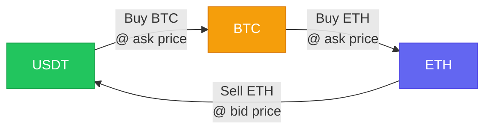
```mermaid
graph LR
    USDT -->|"Buy BTC<br/>@ ask price"| BTC
    BTC -->|"Buy ETH<br/>@ ask price"| ETH
    ETH -->|"Sell ETH<br/>@ bid price"| USDT

    style USDT fill:#22c55e,stroke:#16a34a,color:#fff
    style BTC fill:#f59e0b,stroke:#d97706,color:#fff
    style ETH fill:#6366f1,stroke:#4f46e5,color:#fff
```

> If the product of three exchange rates yields a net gain after fees, the system executes all three trades sequentially to capture the spread.

### Why Triangular Arbitrage?

| Property | Advantage |
|----------|-----------|
| Single exchange | No withdrawal fees, no transfer delays |
| No counterparty risk | Funds never leave Binance |
| Atomic opportunity | All legs execute on same platform |
| Scalable scanning | 2,000+ triangles on Binance |

### Arbitrage Type Comparison

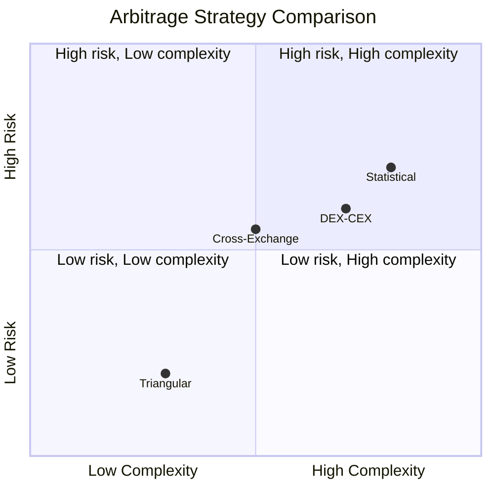
```mermaid
quadrantChart
    title Arbitrage Strategy Comparison
    x-axis Low Complexity --> High Complexity
    y-axis Low Risk --> High Risk
    quadrant-1 High risk, High complexity
    quadrant-2 High risk, Low complexity
    quadrant-3 Low risk, Low complexity
    quadrant-4 Low risk, High complexity
    Triangular: [0.3, 0.2]
    Cross-Exchange: [0.5, 0.55]
    Statistical: [0.8, 0.7]
    DEX-CEX: [0.7, 0.6]
```

---

## 2. System Architecture

### 2.1 High-Level Data Flow

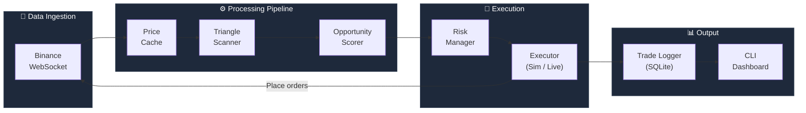
```mermaid
flowchart LR
    subgraph Input["📡 Data Ingestion"]
        WS["Binance<br/>WebSocket"]
    end

    subgraph Processing["⚙️ Processing Pipeline"]
        PC["Price<br/>Cache"]
        TS["Triangle<br/>Scanner"]
        OS["Opportunity<br/>Scorer"]
    end

    subgraph Execution["🎯 Execution"]
        RM["Risk<br/>Manager"]
        EX["Executor<br/>(Sim / Live)"]
    end

    subgraph Output["📊 Output"]
        DB["Trade Logger<br/>(SQLite)"]
        DASH["CLI<br/>Dashboard"]
    end

    WS --> PC --> TS --> OS --> RM --> EX --> DB --> DASH
    EX -->|"Place orders"| WS

    style Input fill:#1e293b,stroke:#334155,color:#fff
    style Processing fill:#1e293b,stroke:#334155,color:#fff
    style Execution fill:#1e293b,stroke:#334155,color:#fff
    style Output fill:#1e293b,stroke:#334155,color:#fff
```

### 2.2 Detailed Component Interaction

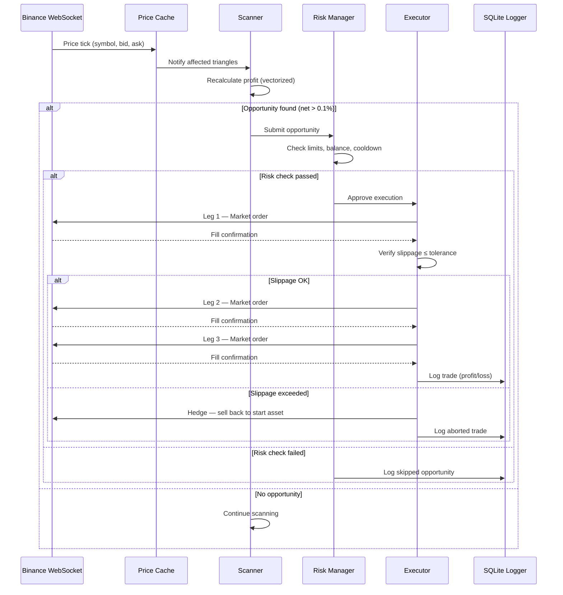
```mermaid
sequenceDiagram
    participant BN as Binance WebSocket
    participant PC as Price Cache
    participant SC as Scanner
    participant RM as Risk Manager
    participant EX as Executor
    participant DB as SQLite Logger

    BN->>PC: Price tick (symbol, bid, ask)
    PC->>SC: Notify affected triangles
    SC->>SC: Recalculate profit (vectorized)

    alt Opportunity found (net > 0.1%)
        SC->>RM: Submit opportunity
        RM->>RM: Check limits, balance, cooldown

        alt Risk check passed
            RM->>EX: Approve execution
            EX->>BN: Leg 1 — Market order
            BN-->>EX: Fill confirmation
            EX->>EX: Verify slippage ≤ tolerance

            alt Slippage OK
                EX->>BN: Leg 2 — Market order
                BN-->>EX: Fill confirmation
                EX->>BN: Leg 3 — Market order
                BN-->>EX: Fill confirmation
                EX->>DB: Log trade (profit/loss)
            else Slippage exceeded
                EX->>BN: Hedge — sell back to start asset
                EX->>DB: Log aborted trade
            end

        else Risk check failed
            RM->>DB: Log skipped opportunity
        end
    else No opportunity
        SC->>SC: Continue scanning
    end
```

### 2.3 Component Descriptions

| Component | Responsibility |
|-----------|---------------|
| **Binance WebSocket** | Subscribe to individual ticker streams for pairs in our triangle set |
| **Price Cache** | In-memory price state (bid/ask + top-5 order book depth) |
| **Triangle Scanner** | Pre-computed graph; on each tick, recalculate only affected triangles |
| **Opportunity Scorer** | Vectorized profit calculation (numpy); filters by min threshold |
| **Executor** | Sequential 3-leg execution with circuit breaker |
| **Risk Manager** | Position limits, daily loss limit, cooldowns, slippage guard |
| **Trade Logger** | SQLite — every opportunity (executed or skipped), full audit trail |
| **Dashboard** | Real-time CLI monitor (rich library) — P&L, scan rate, WebSocket health |

---

## 3. Core Algorithm

### 3.1 Triangle Discovery

At startup, fetch all Binance trading pairs and build a **directed graph**:
- Nodes = assets (BTC, ETH, USDT, BNB, ...)
- Edges = trading pairs with direction (base→quote for sell, quote→base for buy)

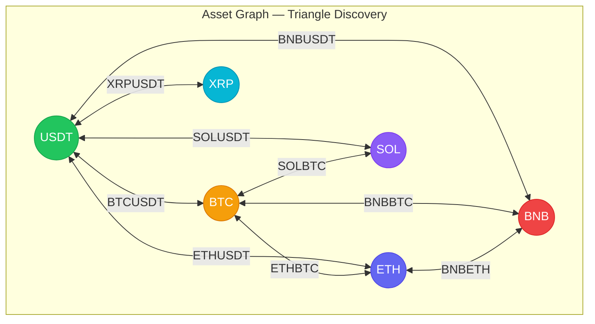
```mermaid
graph TD
    subgraph "Asset Graph — Triangle Discovery"
        USDT((USDT))
        BTC((BTC))
        ETH((ETH))
        BNB((BNB))
        SOL((SOL))
        XRP((XRP))

        USDT <-->|"BTCUSDT"| BTC
        USDT <-->|"ETHUSDT"| ETH
        USDT <-->|"BNBUSDT"| BNB
        USDT <-->|"SOLUSDT"| SOL
        USDT <-->|"XRPUSDT"| XRP
        BTC <-->|"ETHBTC"| ETH
        BTC <-->|"BNBBTC"| BNB
        BTC <-->|"SOLBTC"| SOL
        ETH <-->|"BNBETH"| BNB
    end

    style USDT fill:#22c55e,stroke:#16a34a,color:#fff
    style BTC fill:#f59e0b,stroke:#d97706,color:#fff
    style ETH fill:#6366f1,stroke:#4f46e5,color:#fff
    style BNB fill:#ef4444,stroke:#dc2626,color:#fff
    style SOL fill:#8b5cf6,stroke:#7c3aed,color:#fff
    style XRP fill:#06b6d4,stroke:#0891b2,color:#fff
```

> Every 3-node cycle in this graph is a potential arbitrage triangle. Example triangles: `USDT→BTC→ETH→USDT`, `USDT→BNB→BTC→USDT`, `BTC→ETH→BNB→BTC`

Enumerate all valid 3-node cycles. Store as a list of `Triangle` objects with pre-resolved pair symbols.

### 3.2 Profit Calculation

For a triangle path `A → B → C → A`:

```python
# Forward direction
forward_profit = (1 / ask_AB) * bid_BC * bid_CA - 1

# Reverse direction
reverse_profit = (1 / ask_CA) * (1 / ask_CB) * bid_AB - 1

# Net after fees (3 trades × fee_rate)
net_profit = max(forward_profit, reverse_profit) - (3 * fee_rate)
```

**Both directions** are checked on every update, because the opportunity may only exist in one direction.

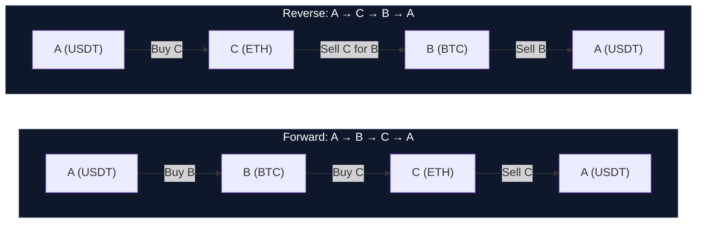
```mermaid
flowchart LR
    subgraph Forward["Forward: A → B → C → A"]
        direction LR
        A1["A (USDT)"] -->|"Buy B"| B1["B (BTC)"]
        B1 -->|"Buy C"| C1["C (ETH)"]
        C1 -->|"Sell C"| A1b["A (USDT)"]
    end

    subgraph Reverse["Reverse: A → C → B → A"]
        direction LR
        A2["A (USDT)"] -->|"Buy C"| C2["C (ETH)"]
        C2 -->|"Sell C for B"| B2["B (BTC)"]
        B2 -->|"Sell B"| A2b["A (USDT)"]
    end

    style Forward fill:#0f172a,stroke:#334155,color:#fff
    style Reverse fill:#0f172a,stroke:#334155,color:#fff
```

### 3.3 Selective Update Strategy

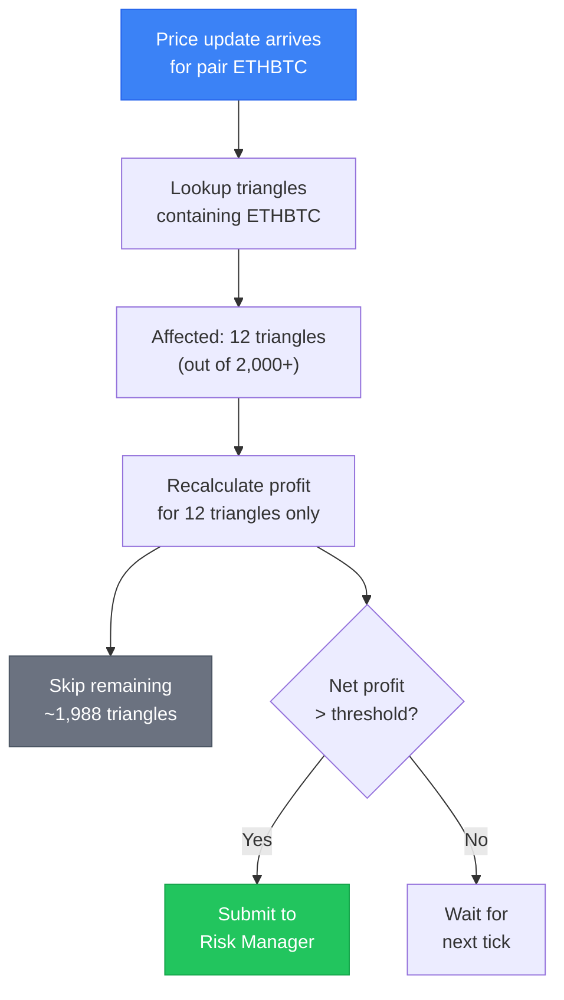
```mermaid
flowchart TD
    TICK["Price update arrives<br/>for pair ETHBTC"] --> LOOKUP["Lookup triangles<br/>containing ETHBTC"]
    LOOKUP --> AFFECTED["Affected: 12 triangles<br/>(out of 2,000+)"]
    AFFECTED --> RECALC["Recalculate profit<br/>for 12 triangles only"]
    RECALC --> SKIP["Skip remaining<br/>~1,988 triangles"]

    RECALC --> CHECK{Net profit<br/>> threshold?}
    CHECK -->|Yes| SUBMIT["Submit to<br/>Risk Manager"]
    CHECK -->|No| WAIT["Wait for<br/>next tick"]

    style TICK fill:#3b82f6,stroke:#2563eb,color:#fff
    style SUBMIT fill:#22c55e,stroke:#16a34a,color:#fff
    style SKIP fill:#6b7280,stroke:#4b5563,color:#fff
```

> This reduces per-tick computation from O(all_triangles) to O(affected_triangles) — ~99% reduction.

### 3.4 Order Book Awareness

Use top-5 order book levels to calculate **executable profit** accounting for:
- Available liquidity at each level
- Slippage for the intended trade size
- Whether the full position can be filled

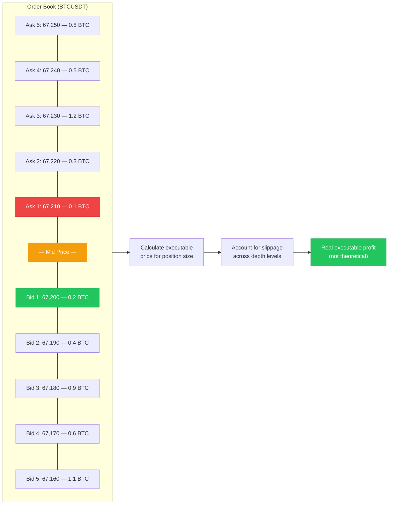
```mermaid
flowchart LR
    subgraph OrderBook["Order Book (BTCUSDT)"]
        direction TB
        ASK5["Ask 5: 67,250 — 0.8 BTC"]
        ASK4["Ask 4: 67,240 — 0.5 BTC"]
        ASK3["Ask 3: 67,230 — 1.2 BTC"]
        ASK2["Ask 2: 67,220 — 0.3 BTC"]
        ASK1["Ask 1: 67,210 — 0.1 BTC"]
        MID["— Mid Price —"]
        BID1["Bid 1: 67,200 — 0.2 BTC"]
        BID2["Bid 2: 67,190 — 0.4 BTC"]
        BID3["Bid 3: 67,180 — 0.9 BTC"]
        BID4["Bid 4: 67,170 — 0.6 BTC"]
        BID5["Bid 5: 67,160 — 1.1 BTC"]

        ASK5 --- ASK4 --- ASK3 --- ASK2 --- ASK1 --- MID --- BID1 --- BID2 --- BID3 --- BID4 --- BID5
    end

    OrderBook --> CALC["Calculate executable<br/>price for position size"]
    CALC --> SLIP["Account for slippage<br/>across depth levels"]
    SLIP --> REAL["Real executable profit<br/>(not theoretical)"]

    style ASK1 fill:#ef4444,stroke:#dc2626,color:#fff
    style BID1 fill:#22c55e,stroke:#16a34a,color:#fff
    style MID fill:#f59e0b,stroke:#d97706,color:#fff
    style REAL fill:#22c55e,stroke:#16a34a,color:#fff
```

---

## 4. Execution Strategy

### 4.1 Sequential with Circuit Breaker

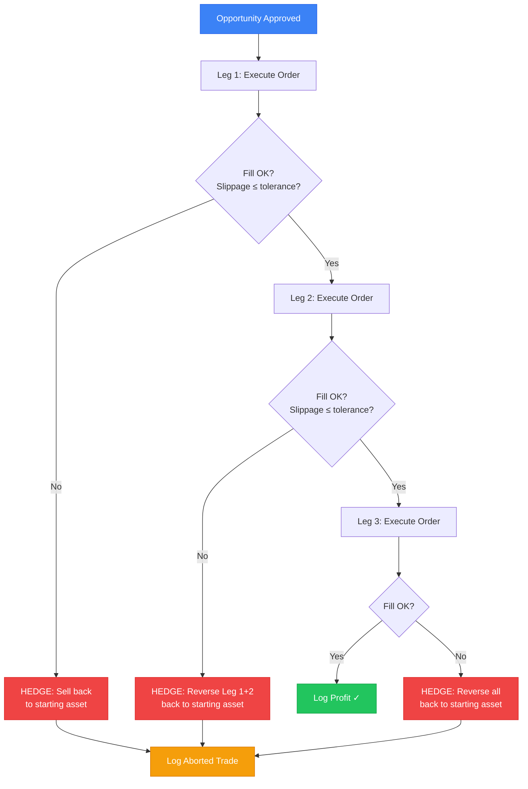
```mermaid
flowchart TD
    START["Opportunity Approved"] --> LEG1["Leg 1: Execute Order"]
    LEG1 --> V1{"Fill OK?<br/>Slippage ≤ tolerance?"}

    V1 -->|"Yes"| LEG2["Leg 2: Execute Order"]
    V1 -->|"No"| HEDGE1["HEDGE: Sell back<br/>to starting asset"]

    LEG2 --> V2{"Fill OK?<br/>Slippage ≤ tolerance?"}

    V2 -->|"Yes"| LEG3["Leg 3: Execute Order"]
    V2 -->|"No"| HEDGE2["HEDGE: Reverse Leg 1+2<br/>back to starting asset"]

    LEG3 --> V3{"Fill OK?"}
    V3 -->|"Yes"| SUCCESS["Log Profit ✓"]
    V3 -->|"No"| HEDGE3["HEDGE: Reverse all<br/>back to starting asset"]

    HEDGE1 --> LOG["Log Aborted Trade"]
    HEDGE2 --> LOG
    HEDGE3 --> LOG

    style START fill:#3b82f6,stroke:#2563eb,color:#fff
    style SUCCESS fill:#22c55e,stroke:#16a34a,color:#fff
    style HEDGE1 fill:#ef4444,stroke:#dc2626,color:#fff
    style HEDGE2 fill:#ef4444,stroke:#dc2626,color:#fff
    style HEDGE3 fill:#ef4444,stroke:#dc2626,color:#fff
    style LOG fill:#f59e0b,stroke:#d97706,color:#fff
```

**Circuit breaker triggers:**
- If any leg's fill price deviates > `slippage_tolerance` from expected
- If a leg fails to fill within timeout (configurable, default 2s)
- On trigger: **abort remaining legs** and **hedge** (market sell back to starting asset)

### 4.2 Order Types

- **Market orders** for execution speed (arb is time-sensitive)
- Limit orders considered for future versions (lower fees but fill risk)

---

## 5. Risk Management

### 5.1 Parameters

```yaml
min_profit_threshold:   0.1%     # Minimum net profit after fees to execute
max_position_size:      $500     # Maximum USD value per triangle execution
daily_loss_limit:       $50      # Kill switch — halt trading for the day
max_open_triangles:     1        # Only one triangle executing at a time (v1)
slippage_tolerance:     0.05%    # Abort if fill deviates beyond this
cooldown_after_loss:    60s      # Pause after a losing trade
max_consecutive_losses: 3        # Halt after 3 losses in a row
```

### 5.2 Risk Decision Tree

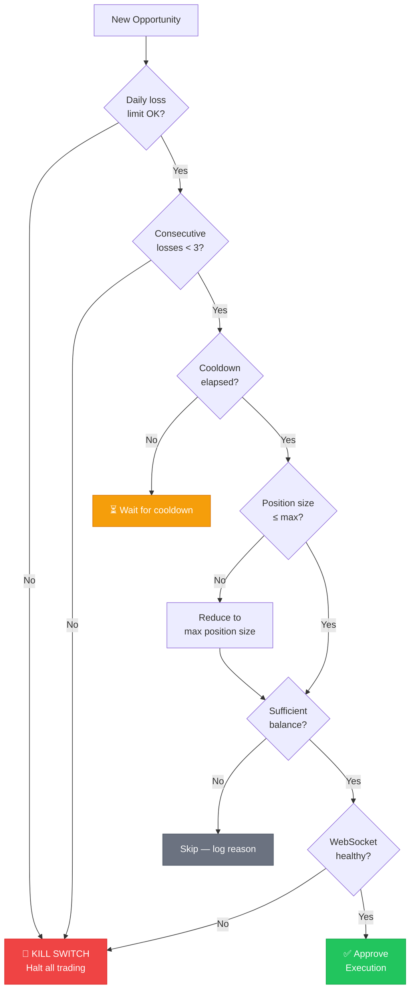
```mermaid
flowchart TD
    OPP["New Opportunity"] --> D1{"Daily loss<br/>limit OK?"}
    D1 -->|"No"| KILL["🛑 KILL SWITCH<br/>Halt all trading"]
    D1 -->|"Yes"| D2{"Consecutive<br/>losses < 3?"}

    D2 -->|"No"| KILL
    D2 -->|"Yes"| D3{"Cooldown<br/>elapsed?"}

    D3 -->|"No"| WAIT["⏳ Wait for cooldown"]
    D3 -->|"Yes"| D4{"Position size<br/>≤ max?"}

    D4 -->|"No"| REDUCE["Reduce to<br/>max position size"]
    D4 -->|"Yes"| D5{"Sufficient<br/>balance?"}

    REDUCE --> D5

    D5 -->|"No"| SKIP["Skip — log reason"]
    D5 -->|"Yes"| D6{"WebSocket<br/>healthy?"}

    D6 -->|"No"| KILL
    D6 -->|"Yes"| APPROVE["✅ Approve<br/>Execution"]

    style KILL fill:#ef4444,stroke:#dc2626,color:#fff
    style APPROVE fill:#22c55e,stroke:#16a34a,color:#fff
    style WAIT fill:#f59e0b,stroke:#d97706,color:#fff
    style SKIP fill:#6b7280,stroke:#4b5563,color:#fff
```

### 5.3 Kill Switch Triggers

The system halts all trading immediately when:
- Daily loss limit is breached
- WebSocket connection drops (stale prices = danger)
- API rate limit is hit (429 response)
- Any unhandled exception in the execution path

### 5.4 Balance Management

- Track balances for all assets in active triangles
- Pre-check sufficient balance before execution
- Reserve a safety margin (don't use 100% of available balance)

---

## 6. Exchange Abstraction

### 6.1 Class Hierarchy

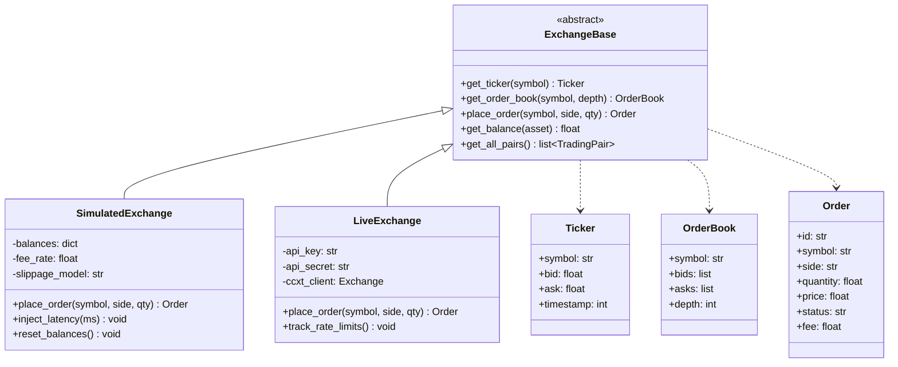
```mermaid
classDiagram
    class ExchangeBase {
        <<abstract>>
        +get_ticker(symbol) Ticker
        +get_order_book(symbol, depth) OrderBook
        +place_order(symbol, side, qty) Order
        +get_balance(asset) float
        +get_all_pairs() list~TradingPair~
    }

    class SimulatedExchange {
        -balances: dict
        -fee_rate: float
        -slippage_model: str
        +place_order(symbol, side, qty) Order
        +inject_latency(ms) void
        +reset_balances() void
    }

    class LiveExchange {
        -api_key: str
        -api_secret: str
        -ccxt_client: Exchange
        +place_order(symbol, side, qty) Order
        +track_rate_limits() void
    }

    ExchangeBase <|-- SimulatedExchange
    ExchangeBase <|-- LiveExchange

    class Ticker {
        +symbol: str
        +bid: float
        +ask: float
        +timestamp: int
    }

    class OrderBook {
        +symbol: str
        +bids: list
        +asks: list
        +depth: int
    }

    class Order {
        +id: str
        +symbol: str
        +side: str
        +quantity: float
        +price: float
        +status: str
        +fee: float
    }

    ExchangeBase ..> Ticker
    ExchangeBase ..> OrderBook
    ExchangeBase ..> Order
```

### 6.2 Implementations

| Class | Purpose |
|-------|---------|
| `SimulatedExchange` | Paper trading — virtual balances, configurable slippage, fee simulation |
| `LiveExchange` | Real Binance API calls via `ccxt` (data) + direct `aiohttp` (orders) |

Switching between modes is a **configuration change**, not a code change.

### 6.3 Simulated Exchange Features

- Virtual balance tracking per asset
- Configurable fee rates (match Binance tiers)
- Configurable slippage model (fixed, random, depth-based)
- Fill simulation using real order book snapshots
- Latency injection for realistic timing

---

## 7. Data & Logging

### 7.1 Data Layer Overview

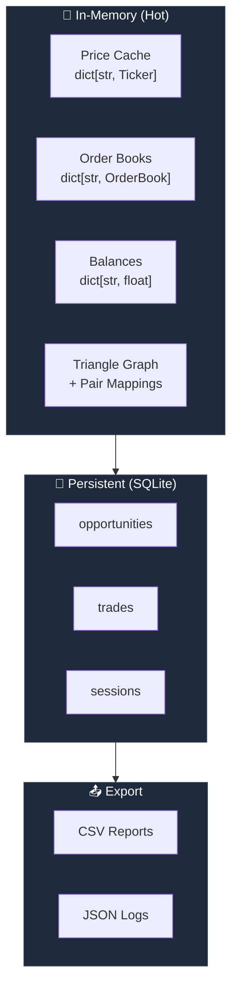
```mermaid
flowchart TB
    subgraph InMemory["🧠 In-Memory (Hot)"]
        PRICES["Price Cache<br/>dict[str, Ticker]"]
        BOOKS["Order Books<br/>dict[str, OrderBook]"]
        BALS["Balances<br/>dict[str, float]"]
        GRAPH["Triangle Graph<br/>+ Pair Mappings"]
    end

    subgraph Persistent["💾 Persistent (SQLite)"]
        OPP["opportunities"]
        TRADES["trades"]
        SESSIONS["sessions"]
    end

    subgraph Export["📤 Export"]
        CSV["CSV Reports"]
        JSON["JSON Logs"]
    end

    InMemory --> Persistent
    Persistent --> Export

    style InMemory fill:#1e293b,stroke:#334155,color:#fff
    style Persistent fill:#1e293b,stroke:#334155,color:#fff
    style Export fill:#1e293b,stroke:#334155,color:#fff
```

### 7.2 SQLite Database Schema

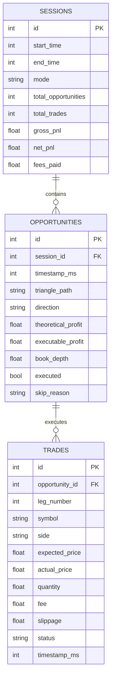
```mermaid
erDiagram
    SESSIONS ||--o{ OPPORTUNITIES : contains
    OPPORTUNITIES ||--o{ TRADES : executes

    SESSIONS {
        int id PK
        int start_time
        int end_time
        string mode
        int total_opportunities
        int total_trades
        float gross_pnl
        float net_pnl
        float fees_paid
    }

    OPPORTUNITIES {
        int id PK
        int session_id FK
        int timestamp_ms
        string triangle_path
        string direction
        float theoretical_profit
        float executable_profit
        float book_depth
        bool executed
        string skip_reason
    }

    TRADES {
        int id PK
        int opportunity_id FK
        int leg_number
        string symbol
        string side
        float expected_price
        float actual_price
        float quantity
        float fee
        float slippage
        string status
        int timestamp_ms
    }
```

### 7.3 Logging Strategy

- **Structured JSON logs** for machine parsing
- Log every opportunity seen (even skipped) — critical for tuning
- **Never log API keys or secrets**
- Log levels: DEBUG (price ticks), INFO (opportunities), WARNING (slippage), ERROR (failures)

---

## 8. Binance API Strategy

### 8.1 WebSocket Connection Architecture

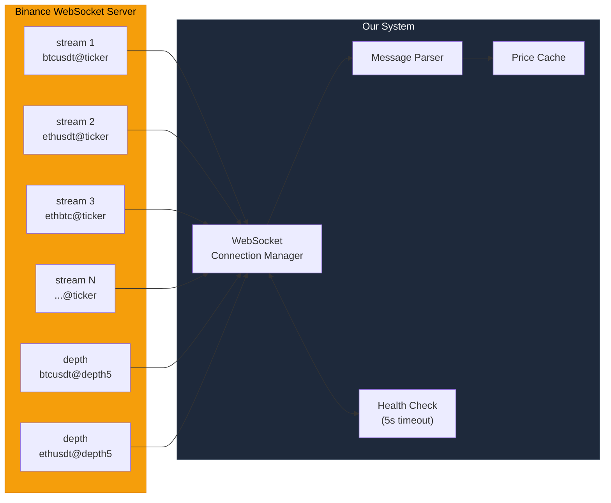
```mermaid
flowchart LR
    subgraph Binance["Binance WebSocket Server"]
        S1["stream 1<br/>btcusdt@ticker"]
        S2["stream 2<br/>ethusdt@ticker"]
        S3["stream 3<br/>ethbtc@ticker"]
        SN["stream N<br/>...@ticker"]
        D1["depth<br/>btcusdt@depth5"]
        D2["depth<br/>ethusdt@depth5"]
    end

    subgraph Bot["Our System"]
        CONN["WebSocket<br/>Connection Manager"]
        PARSE["Message Parser"]
        PC["Price Cache"]
        HEALTH["Health Check<br/>(5s timeout)"]
    end

    S1 --> CONN
    S2 --> CONN
    S3 --> CONN
    SN --> CONN
    D1 --> CONN
    D2 --> CONN
    CONN --> PARSE --> PC
    CONN <--> HEALTH

    style Binance fill:#f59e0b,stroke:#d97706,color:#000
    style Bot fill:#1e293b,stroke:#334155,color:#fff
```

- Subscribe to **individual pair streams** (`symbol@ticker`) for low latency
- Subscribe to **top-5 depth** (`symbol@depth5@100ms`) for order book
- Only subscribe to pairs that are part of valid triangles (~100-200 pairs)
- Implement automatic reconnection with exponential backoff
- **Health check**: if no message received in 5s, trigger reconnect

### 8.2 WebSocket Reconnection Flow

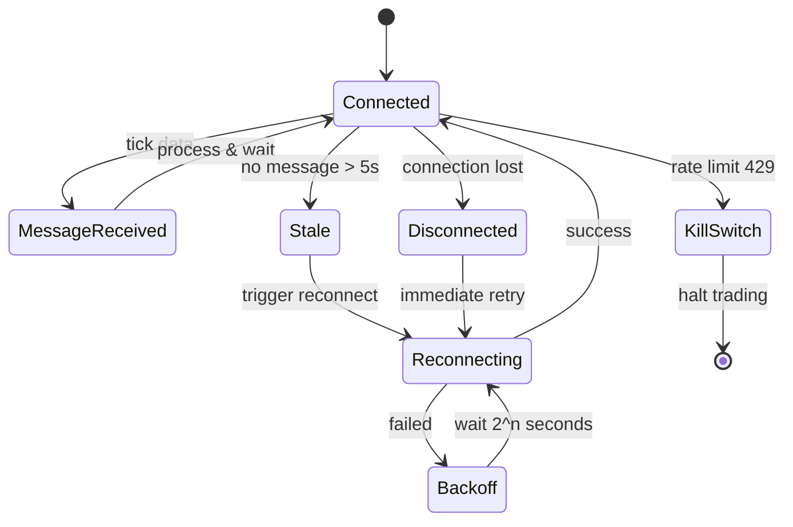
```mermaid
stateDiagram-v2
    [*] --> Connected
    Connected --> MessageReceived: tick data
    MessageReceived --> Connected: process & wait

    Connected --> Stale: no message > 5s
    Stale --> Reconnecting: trigger reconnect
    Reconnecting --> Connected: success
    Reconnecting --> Backoff: failed
    Backoff --> Reconnecting: wait 2^n seconds

    Connected --> Disconnected: connection lost
    Disconnected --> Reconnecting: immediate retry

    Connected --> KillSwitch: rate limit 429
    KillSwitch --> [*]: halt trading
```

### 8.3 REST API

- Used for: placing orders, fetching balances, getting exchange info
- Rate limits: 10 orders/sec, 1200 request weight/min
- Track rate limit headers and throttle proactively

### 8.4 Fee Structure

| Tier | Maker | Taker | With BNB |
|------|-------|-------|----------|
| Regular | 0.10% | 0.10% | 0.075% |
| VIP 1 | 0.09% | 0.10% | 0.0675% |

**Break-even per triangle** = 3 × fee_rate (e.g., 3 × 0.075% = 0.225%)

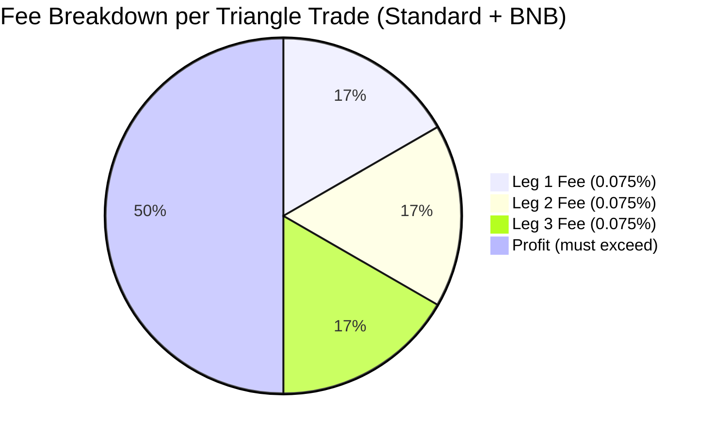
```mermaid
pie title Fee Breakdown per Triangle Trade (Standard + BNB)
    "Leg 1 Fee (0.075%)" : 0.075
    "Leg 2 Fee (0.075%)" : 0.075
    "Leg 3 Fee (0.075%)" : 0.075
    "Profit (must exceed)" : 0.225
```

---

## 9. Project Structure

```
crypto-triangular-arbitrage/
├── main.py                      # Entry point, arg parsing, mode selection
├── config/
│   ├── settings.py              # Dataclass-based config (fees, thresholds)
│   └── .env.example             # Template for API keys
├── core/
│   ├── models.py                # Data models (Opportunity, Trade, Triangle)
│   ├── triangle.py              # Triangle discovery & graph builder
│   ├── scanner.py               # Real-time opportunity detection (vectorized)
│   └── calculator.py            # Profit calculation with fees & slippage
├── exchange/
│   ├── base.py                  # Abstract exchange interface
│   ├── binance_ws.py            # WebSocket price/orderbook feeds
│   ├── binance_rest.py          # REST API (orders, balances)
│   └── simulator.py             # Simulated exchange for paper trading
├── execution/
│   ├── executor.py              # Trade executor with circuit breaker
│   ├── risk_manager.py          # Position limits, loss limits, cooldowns
│   └── order_manager.py         # Order tracking, partial fill handling
├── data/
│   ├── db.py                    # SQLite setup, trade/opportunity logging
│   └── price_cache.py           # In-memory price state
├── dashboard/
│   └── cli_monitor.py           # Real-time CLI dashboard (rich library)
├── backtest/
│   ├── data_recorder.py         # Record live data for replay
│   └── replayer.py              # Replay historical data through scanner
├── tests/
│   ├── test_triangle.py
│   ├── test_calculator.py
│   ├── test_executor.py
│   └── test_risk_manager.py
├── architecture.md              # This document
├── requirements.txt
├── .env.example
├── .gitignore
└── README.md
```

---

## 10. Technology Stack

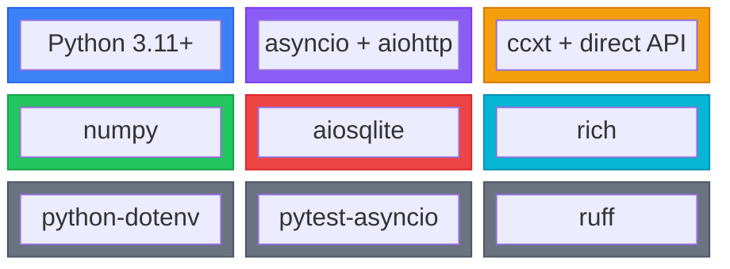
```mermaid
block-beta
    columns 3

    block:lang["Language"]
        Python["Python 3.11+"]
    end
    block:async["Async Runtime"]
        Asyncio["asyncio + aiohttp"]
    end
    block:exchange["Exchange"]
        CCXT["ccxt + direct API"]
    end

    block:math["Math Engine"]
        NumPy["numpy"]
    end
    block:db["Database"]
        SQLite["aiosqlite"]
    end
    block:ui["Dashboard"]
        Rich["rich"]
    end

    block:config["Config"]
        Dotenv["python-dotenv"]
    end
    block:test["Testing"]
        Pytest["pytest-asyncio"]
    end
    block:lint["Linting"]
        Ruff["ruff"]
    end

    style lang fill:#3b82f6,stroke:#2563eb,color:#fff
    style async fill:#8b5cf6,stroke:#7c3aed,color:#fff
    style exchange fill:#f59e0b,stroke:#d97706,color:#fff
    style math fill:#22c55e,stroke:#16a34a,color:#fff
    style db fill:#ef4444,stroke:#dc2626,color:#fff
    style ui fill:#06b6d4,stroke:#0891b2,color:#fff
    style config fill:#6b7280,stroke:#4b5563,color:#fff
    style test fill:#6b7280,stroke:#4b5563,color:#fff
    style lint fill:#6b7280,stroke:#4b5563,color:#fff
```

| Component | Technology | Reason |
|-----------|-----------|--------|
| Language | Python 3.11+ | Async support, numpy, rich ecosystem |
| Async | asyncio + aiohttp | Non-blocking I/O for WebSocket + REST |
| Exchange API | ccxt (data) + direct aiohttp (orders) | Unified interface + low-latency execution |
| Math | numpy | Vectorized profit calculation across all triangles |
| Database | SQLite (aiosqlite) | Lightweight, zero-config, sufficient for single-exchange |
| Dashboard | rich | Beautiful CLI tables, live updating |
| Config | python-dotenv + dataclasses | Type-safe config, secure key management |
| Testing | pytest + pytest-asyncio | Async test support |
| Linting | ruff | Fast, comprehensive Python linter |

---

## 11. Development Phases

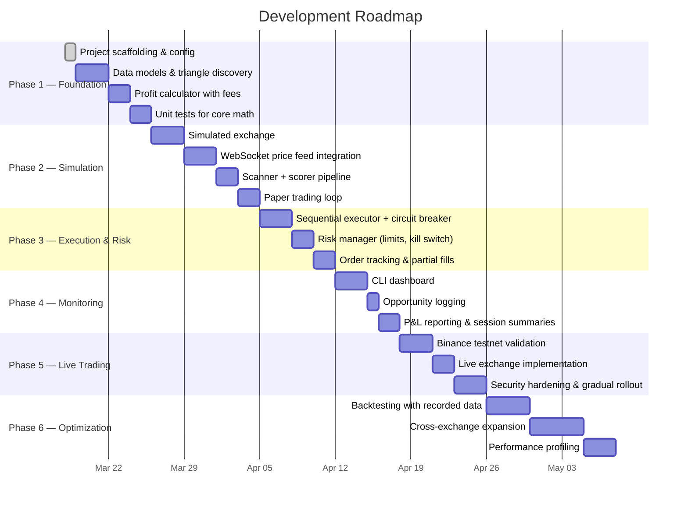
```mermaid
gantt
    title Development Roadmap
    dateFormat  YYYY-MM-DD
    axisFormat  %b %d

    section Phase 1 — Foundation
    Project scaffolding & config        :done, p1a, 2026-03-18, 1d
    Data models & triangle discovery    :p1b, after p1a, 3d
    Profit calculator with fees         :p1c, after p1b, 2d
    Unit tests for core math            :p1d, after p1c, 2d

    section Phase 2 — Simulation
    Simulated exchange                  :p2a, after p1d, 3d
    WebSocket price feed integration    :p2b, after p2a, 3d
    Scanner + scorer pipeline           :p2c, after p2b, 2d
    Paper trading loop                  :p2d, after p2c, 2d

    section Phase 3 — Execution & Risk
    Sequential executor + circuit breaker :p3a, after p2d, 3d
    Risk manager (limits, kill switch)  :p3b, after p3a, 2d
    Order tracking & partial fills      :p3c, after p3b, 2d

    section Phase 4 — Monitoring
    CLI dashboard                       :p4a, after p3c, 3d
    Opportunity logging                 :p4b, after p4a, 1d
    P&L reporting & session summaries   :p4c, after p4b, 2d

    section Phase 5 — Live Trading
    Binance testnet validation          :p5a, after p4c, 3d
    Live exchange implementation        :p5b, after p5a, 2d
    Security hardening & gradual rollout:p5c, after p5b, 3d

    section Phase 6 — Optimization
    Backtesting with recorded data      :p6a, after p5c, 4d
    Cross-exchange expansion            :p6b, after p6a, 5d
    Performance profiling               :p6c, after p6b, 3d
```

### Phase Details

#### Phase 1 — Foundation (Current)
- [x] Project scaffolding and config
- [ ] Data models and triangle discovery
- [ ] Profit calculator with fee accounting
- [ ] Unit tests for core math

#### Phase 2 — Simulation Engine
- [ ] Simulated exchange with virtual balances
- [ ] WebSocket price feed integration
- [ ] Scanner + scorer pipeline
- [ ] Paper trading loop

#### Phase 3 — Execution & Risk
- [ ] Sequential executor with circuit breaker
- [ ] Risk manager (limits, kill switch, cooldowns)
- [ ] Order tracking and partial fill handling

#### Phase 4 — Monitoring & Analysis
- [ ] CLI dashboard
- [ ] Opportunity logging (all seen, not just executed)
- [ ] P&L reporting and session summaries

#### Phase 5 — Live Trading
- [ ] Binance testnet validation
- [ ] Live exchange implementation
- [ ] IP whitelist and security hardening
- [ ] Gradual rollout with small position sizes

#### Phase 6 — Optimization (Future)
- [ ] Backtesting with recorded data
- [ ] Cross-exchange arbitrage expansion
- [ ] Advanced slippage models
- [ ] Performance profiling and latency reduction

---

## 12. Security Checklist

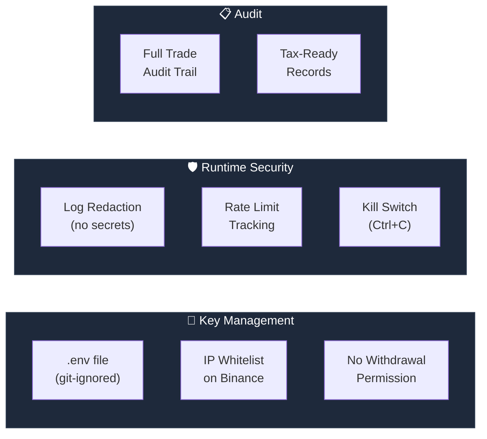
```mermaid
flowchart LR
    subgraph KeyMgmt["🔑 Key Management"]
        ENV[".env file<br/>(git-ignored)"]
        IP["IP Whitelist<br/>on Binance"]
        NOPERM["No Withdrawal<br/>Permission"]
    end

    subgraph Runtime["🛡️ Runtime Security"]
        REDACT["Log Redaction<br/>(no secrets)"]
        RATE["Rate Limit<br/>Tracking"]
        KILL["Kill Switch<br/>(Ctrl+C)"]
    end

    subgraph Audit["📋 Audit"]
        TRAIL["Full Trade<br/>Audit Trail"]
        TAX["Tax-Ready<br/>Records"]
    end

    style KeyMgmt fill:#1e293b,stroke:#334155,color:#fff
    style Runtime fill:#1e293b,stroke:#334155,color:#fff
    style Audit fill:#1e293b,stroke:#334155,color:#fff
```

- [x] API keys in `.env`, never committed to git
- [x] `.gitignore` covers `.env`, `*.db`, `__pycache__`, logs
- [ ] Binance API key: **IP whitelisted**, **no withdrawal permission**
- [ ] Log redaction — no secrets in logs, even partially
- [ ] Rate limit tracking to avoid API bans
- [ ] Kill switch accessible via CLI signal (Ctrl+C graceful shutdown)

---

## 13. Compliance Notes

- Maintain full audit trail of all trades and decisions
- Implement reasonable throttling to avoid wash-trading detection flags
- Keep records suitable for tax reporting (all trades with timestamps, amounts, fees)
- Respect Binance Terms of Service — API trading is permitted

---

*Document generated from expert panel consensus — Dr. Wei Chen (Quant), Sarah Kovacs (Exchange), Raj Patel (Architect), Elena Rossi (Risk), Marcus Thompson (Python), Dr. Yuki Tanaka (Microstructure), Nina Okafor (DevOps), James Liu (Data), Anika Sharma (Security), Carlos Mendez (Compliance)*
